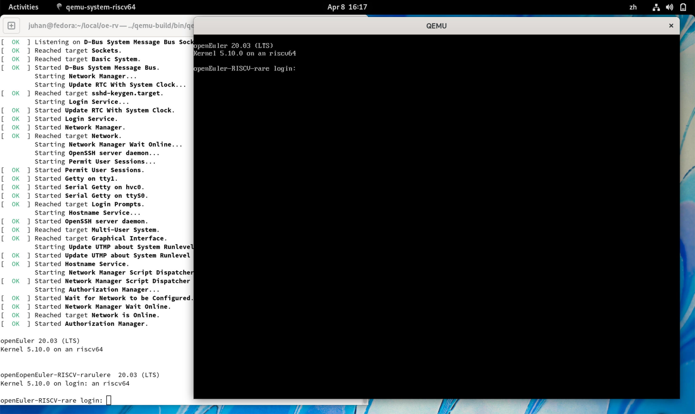
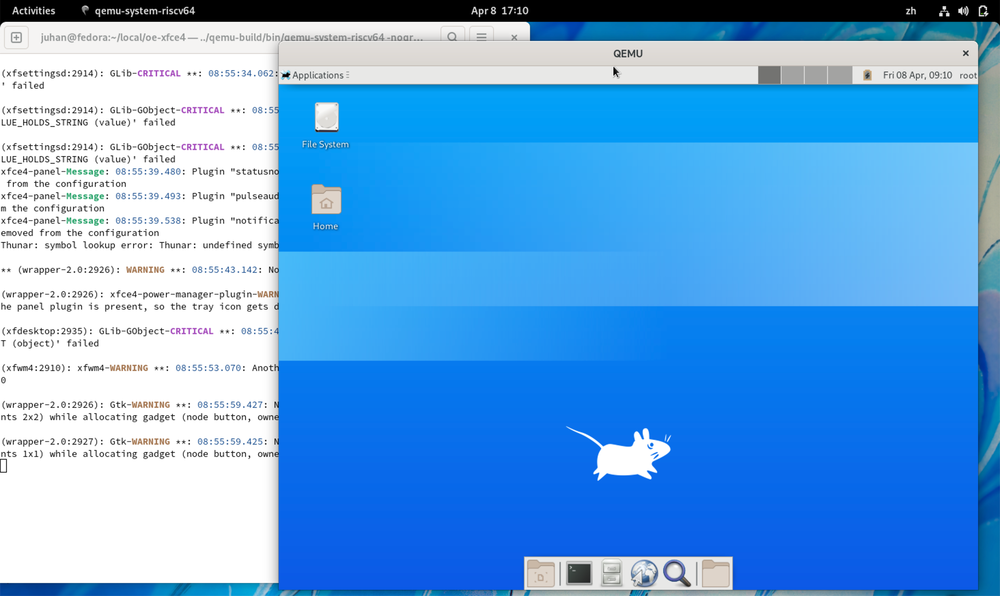
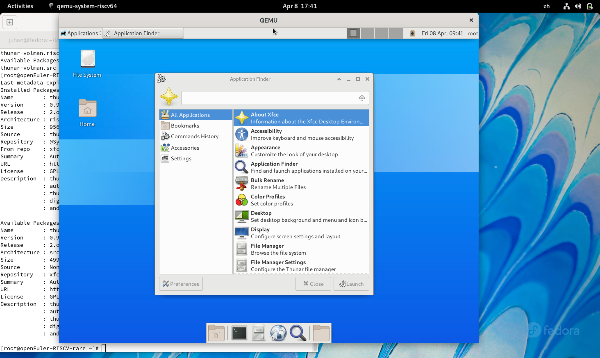
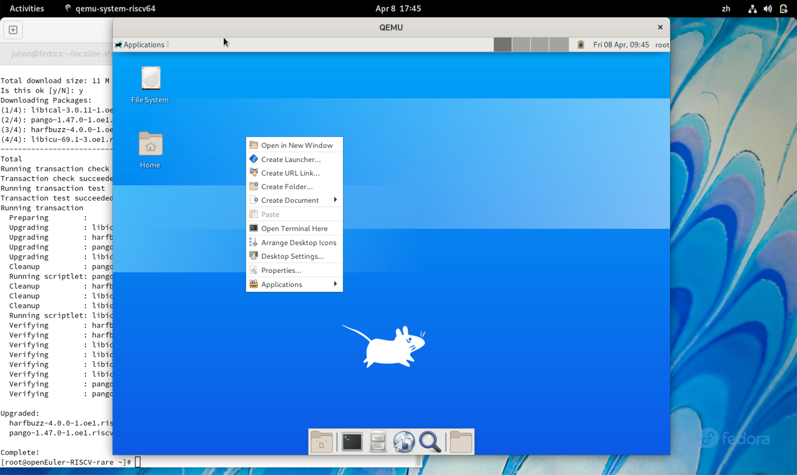
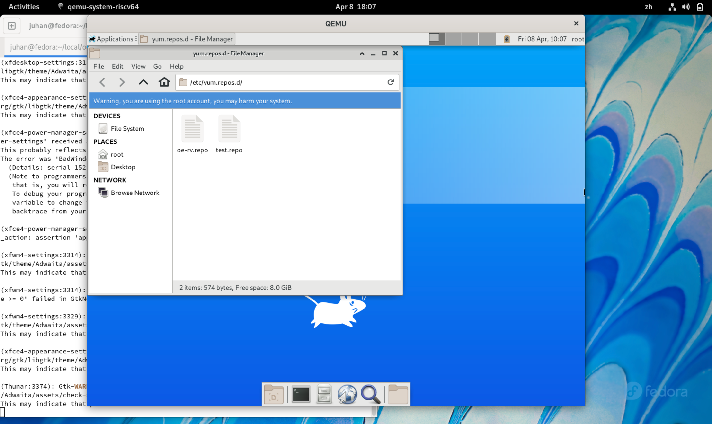
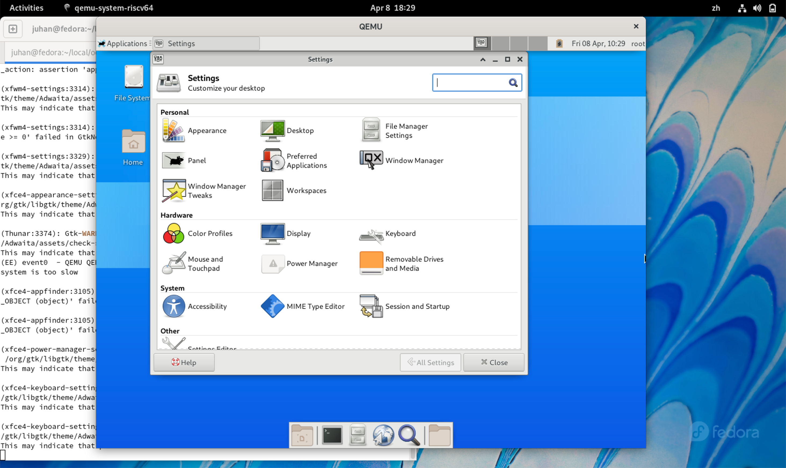

# 在 QEMU上的 openEuler RISC-V 中启动并测试 Xfce

**备注：由于gitee政策变更，临时转为GitHub**

## 准备阶段

1.  编译支持视频输出的 qemu

    ``` console
    $ git clone https://gitlab.com/wangjunqiang/qemu
    $ cd qemu
    $ git switch display
    ```

    按照上面指令 git clone qemu 源代码。display 分支增加了视频输出功能，一定要切换到 display 分支后再进行编译。

    ``` console
    $ ./configure --target-list=riscv64-softmmu --prefix=/home/xx/program/riscv64-qemu --enable-kvm  --enable-sdl --enable-gtk --enable-virglrenderer --enable-opengl
    $ make
    $ make install
    ```

    按照上面指令编译 qemu，prefix 需要换成一个存在的文件夹。编译过程可参考[下载 QEMU 源代码并构建](https://gitee.com/openeuler/RISC-V/blob/master/doc/tutorials/vm-qemu-oErv.md#i-%E4%B8%8B%E8%BD%BD-qemu-%E6%BA%90%E4%BB%A3%E7%A0%81%E5%B9%B6%E6%9E%84%E5%BB%BA)。中间可能需要各种依赖，按照报错装上即可。

2.  编译支持视频输出的 kernel

    直接下载 [Image-mouse-kbd](Image-mouse-kbd) 即可。该 kernel 在 openeuler OLK 5.10 最新 kernel 的基础上加上了 bochs drm 视频驱动以及 xfce 中对键鼠使用的支持。

3.  下载 openeuler risc-v 文件系统

    https://mirror.iscas.ac.cn/openeuler/openEuler-preview/RISC-V/Image/openEuler-preview.riscv64.qcow2

4.  用 qemu 启动 openeuler risc-v

    ```
    qemu-system-riscv64 \
    -nographic -machine virt -smp 8 -m 2G \
    -display sdl -vga std \
    -kernel Image-mouse-kbd \
    -append "loglevel=3 swiotlb=1 console=ttyS0 rw root=/dev/vda1" \
    -object rng-random,filename=/dev/urandom,id=rng0 \
    -device virtio-rng-device,rng=rng0 \
    -device virtio-blk-device,drive=hd0 \
    -drive file=openEuler-preview.riscv64.qcow2,format=qcow2,id=hd0 \
    -device virtio-net-device,netdev=usernet \
    -netdev user,id=usernet,hostfwd=tcp::10000-:22 \
    -device qemu-xhci -device usb-tablet -device usb-kbd
    ```

    `qemu-system-riscv64` 一定要是我们自己编译的带视频输出功能的 qemu，如果编译完成后 `qemu-system-riscv64` 所在的文件夹没有加到 `PATH` 环境变量里，上面的命令需要用相对路径指定我们自己编译的 `qemu-system-riscv64`。

    `-kernel` 后面跟的是我们自己编译的内核。

    启动好以后，会出现一个标题为 QEMU 的视频输出窗口，如下所示：

    

5.  安装需要的软件包

    openeuler risc-v 启动以后，增加以下 repo：

    ```
    [standard]
    name=standard
    baseurl=http://119.3.219.20:82/openEuler:/Mainline:/RISC-V/standard_riscv64/
    enabled=1
    gpgcheck=0

    [xfce4]
    name=xfce4
    baseurl=http://121.36.3.168:82/home:/pandora:/xfce4/webkit2gtk3/
    enabled=1
    gpgcheck=0

    [xfce]
    name=xfce
    baseurl=http://121.36.3.168:82/home:/pandora:/xfce/standard_riscv64/
    enabled=1
    gpgcheck=0
    ```

    然后按照下面的顺序，安装 xfce4 需要的软件包：

    ```
    libxfce4util
    xfconf
    libxfce4ui
    exo
    garcon
    thunar
    thunar-volman
    tumbler
    xfce4-appfinder
    xfce4-panel
    xfce4-power-manager
    xfce4-settings
    xfdesktop
    xfwm4
    xfce4-session
    ```

    安装过程中，有些包可能会已经以依赖的形式被安装了，没关系直接跳过。

    另外需要 `dnf upgrade pango`，不然文件管理器不能正常打开。

    再安装 xorg 的软件包 xorg-x11-xinit 和 xorg-x11-server。

6.  启动 xfce4

    在输入启动 openeuler risc-v 命令的终端模拟器（下方图片中的白色窗口）输入 `startxfce4` 启动 xfce4，启动过程非常慢，需要耐心等待。启动成功的界面如下所示：

    

## 测试阶段

xfce4 桌面环境的组成[包括 core modules 和 applications](https://docs.xfce.org/start)，具体如下。在准备阶段我们只安装了 core modules，所以先对 core modules 开展测试。如果在运行 xfce4 应用的过程中出现报错或者无响应的情况，终端模拟器内会给出相应的错误提示。

注意，测试的功能多少和最后收到的金额成正比。

- Core Modules
  - Application Finder (xfce4-appfinder) – Application to quickly run applications and commands
  - Configuration Storage System (xfconf) – D-Bus-based configuration storage system
  - Desktop Manager (xfdesktop) – Configure the desktop background image, icons, launchers and folders
  - Development Tools (xfce4-dev-tools) – A set of scripts and m4/autoconf macros that ease build system maintenance.
  - Helper Applications (exo) – Manage preferred applications and edit .desktop files
  - File Manager (thunar) – The fast and easy to use file manager for the Xfce Desktop
  - Menu Library (garcon) – Library used for menu implementation
  - Panel (xfce4-panel) – Application launchers, window buttons, applications menu, workspace switcher and more
  - Power Manager (xfce4-power-manager) – Manage power sources and power consumption of devices
  - Session Manager (xfce4-session) – Save the state of your desktop and restore it on the next startup
  - Settings Manager (xfce4-settings) – The Settings daemon which persists many Xfce settings
  - Thumbnail Service (tumbler) – A D-Bus service for applications to request thumbnails for various URI schemes and MIME types
  - Utility Sharing Library (libxfce4util) – Library used to share commonly used non-GTK+ utilities among the Xfce applications
  - Widget Sharing Library (libxfce4ui) – Used to share commonly used Xfce widgets among the Xfce applications
  - Window Manager (xfwm4) – Handles the placement of windows on the screen

### Application Finder (xfce4-appfinder)

Application to quickly run applications and commands.

打开 application finder，主要测试 application finder 能否正常启动应用以及左下角preferences 里的功能。用文字和图片的形式进行记录。



### Desktop Manager (xfdesktop)

Configure the desktop background image, icons, launchers and folders.

在桌面上右键，测试菜单中的功能，观察运行结果是否符合预期。用文字和图片的形式进行记录。



### File Manager (thunar)

The fast and easy to use file manager for the Xfce Desktop.

打开文件管理器，测试常用功能，观察运行结果是否符合预期。用文字和图片的形式进行记录。



### Panel (xfce4-panel)

Application launchers, window buttons, applications menu, workspace switcher and more.

测试桌面 launcher、窗口里的按钮、菜单、workspace 切换是否正常。用文字和图片的形式进行记录。

### Settings Manager (xfce4-settings)

The Settings daemon which persists many Xfce settings.

打开 settings manager，从上到下，从左到右，三个一组，18 个组件一共分为 6 组。

1.  Appearance, Desktop, File Manager Settings
2.  Panel, Preferred Applications, Window Manager
3.  Window Manager Tweaks, Workspaces, Color Profiles
4.  Display, Keyboard, Mouse and Touchpad
5.  Power Manager, Removable Drives and Media, Accessibility
6.  MIME Type Editor, Session and Startup, Settings Editor

根据自己选择的组别，对三个组件里的功能进行测试，观察运行结果是否符合预期。用文字和图片的形式进行记录。


