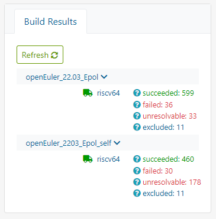
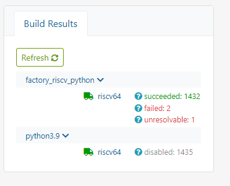

# openEuler RISC-V 开源操作系统进展·第007期·2022年06月02日

## 卷首语

## 本期亮点

### 新增PR：+17个

| rvPRUser    | packageName                       | rvPRStatus | rvPRUrl                                                      | created_at          |
| ----------- | --------------------------------- | ---------- | ------------------------------------------------------------ | ------------------- |
| Jingwiw     | firefox                           | open       | https://gitee.com/openEuler-RISC-V/firefox/pulls/1           | 2022-05-31 11:11:54 |
| HKGY        | perl-GD                           | open       | https://gitee.com/openEuler-RISC-V/perl-GD/pulls/1           | 2022-05-28 01:58:12 |
| lvxiaoqian  | python_cmake_module               | open       | https://gitee.com/openEuler-RISC-V/python_cmake_module/pulls/1 | 2022-06-01 10:54:50 |
| lvxiaoqian  | python-quantities                 | open       | https://gitee.com/openEuler-RISC-V/python-quantities/pulls/2 | 2022-06-01 10:53:31 |
| YukariChiba | python-quantities                 | open       | https://gitee.com/openEuler-RISC-V/python-quantities/pulls/1 | 2022-05-24 22:51:58 |
| lvxiaoqian  | python-setuptools_scm_git_archive | open       | https://gitee.com/openEuler-RISC-V/python-setuptools_scm_git_archive/pulls/1 | 2022-06-01 10:51:37 |
| SEmmmer     | python-stem                       | open       | https://gitee.com/openEuler-RISC-V/python-stem/pulls/2       | 2022-05-22 01:49:57 |
| yinxx       | springframework                   | open       | https://gitee.com/openEuler-RISC-V/springframework/pulls/3   | 2022-05-29 09:12:19 |
| YukariChiba | vid.stab                          | open       | https://gitee.com/openEuler-RISC-V/vid.stab/pulls/1          | 2022-05-24 22:54:00 |
| Jingwiw     | vlc                               | open       | https://gitee.com/openEuler-RISC-V/vlc/pulls/1               | 2022-05-31 11:51:07 |
| SEmmmer     | golang                            | merged     | https://gitee.com/openEuler-RISC-V/golang/pulls/2            | 2022-05-23 17:20:35 |
| YukariChiba | nodejs-is-regex                   | merged     | https://gitee.com/openEuler-RISC-V/nodejs-is-regex/pulls/1   | 2022-05-24 12:51:40 |
| YukariChiba | nodejs-is-symbol                  | merged     | https://gitee.com/openEuler-RISC-V/nodejs-is-symbol/pulls/1  | 2022-05-24 13:03:48 |
| Jingwiw     | nss                               | merged     | https://gitee.com/openEuler-RISC-V/nss/pulls/2               | 2022-05-30 21:23:11 |
| XYenChi     | python-sphobjinv                  | merged     | https://gitee.com/openEuler-RISC-V/python-sphobjinv/pulls/3  | 2022-05-19 17:11:19 |
| YukariChiba | python-zarr                       | merged     | https://gitee.com/openEuler-RISC-V/python-zarr/pulls/1       | 2022-05-24 22:49:59 |
| YukariChiba | wxPython                          | merged     | https://gitee.com/openEuler-RISC-V/wxPython/pulls/1          | 2022-05-24 20:28:58 |


### OBS构建工程进展

- 新建obs工程：[openEuler:selfbuild:repo](https://build.tarsier-infra.com/project/show/openEuler:selfbuild:repo) 作为[openEuler:22.03](https://build.tarsier-infra.com/project/show/openEuler:22.03) 自构建种子

- 新建obs工程：[Factory:RISC-V:Mozilla](https://build.tarsier-infra.com/project/show/Factory:RISC-V:Mozilla)

- [Factory:RISC-V:Kernel](https://build.tarsier-infra.com/project/show/Factory:RISC-V:Kernel) ：15/15

  - 为qemu、D1、unmatched三种不同镜像所需的kernel、opensbi、uboot进行管理和构建；

- [Factory:RISC-V](https://build.tarsier-infra.com/project/show/Factory:RISC-V) ：3574/4202

- [openEuler:22.03](https://build.tarsier-infra.com/project/show/openEuler:22.03) ：4113/4203

  - 工程总包数量从4184 增加到 4203；41个包变更（新增19个新包）；

    

  - 新建Repo：[openEuler_2203_self](https://build.tarsier-infra.com/project/repository_state/openEuler:22.03/openEuler_2203_self) 

    - 开始自构建刷包

    - 许多java相关包构建时测试项无法成功，导致构建失败：采用暂时关闭工程所有包check方式以解决依赖问题，然后再开启包check回归正常构建

- [openEuler:22.03:Epol](https://build.tarsier-infra.com/project/show/openEuler:22.03:Epol) ：599/679  

  

- [Factory:RISC-V:Python](https://build.tarsier-infra.com/project/show/Factory:RISC-V:Python) ：1432/1435  

  - 47个包更新

  

  

### RISC-V 软件源&每日镜像计划

- 更新文档： [ORSP004 openEuler RISC-V 快照镜像产生机制](https://gitee.com/openeuler/RISC-V/blob/f602123080c69b597b361094e5f0dec42466f482/proposal/ORSP004.md)

- 每日镜像：已经初步能够生成qemu、D1、unmatched 3种镜像：https://repo.tarsier-infra.com/openEuler-RISC-V/compose/20220530/v0.2/

  

### 测试

- 对镜像源qemu镜像的检验：https://gitee.com/phoebe-xi/rv-oe_work/issues/I594B0

- 对xfce进行测试并发现缺陷29个：https://gitee.com/openeuler/RISC-V/issues?utf8=%E2%9C%93&issue_search=Xfce%E7%BC%BA%E9%99%B7

### misaka00251

这两周继续完善自动构建镜像相关的工作，因为关系到 QA 所以修包方面优先级调低。计划中的 QEMU 的测试软件包工作现在也已经编写完成，并在个人环境测试后移植到 oerv 环境侧。

目前自动构建镜像的新增成果：

 - 优化了走一遍流程的时间，从 2 小时缩短到 1 小时。
 - 能够对 QEMU 镜像进行基础功能性测试，并可添加外部脚本进行增量测试。
 - 细节优化，尽量做到开箱即用。
 - 对镜像进行了区分，让用户快速知道自己想下载什么阶段的镜像（每日构建版、测试版还是稳定板？）

目前还对自动构建镜像里面的 VisionFive 版本进行了 bootup 测试，发现仍有一些问题需要解决，已经汇报给俊强老师。

在上游 2209 的发版工作开始之后，遂打算让 texlive 2021 能进入 openEuler RISC-V 的 2209 发版，故开始整理缺失的 perl 和 R 语言依赖。缺失的架构依赖后续也要进行移植。

#### 已提交 PR/OBS

 - Gitee 没有 :(
 - 陆续提交上游存在但 openEuler RISC-V 没有的包
   - [perl-Test-Taint](https://build.tarsier-infra.com/request/show/113)
   - [perl-Test-Memory-Cycle](https://build.tarsier-infra.com/request/show/114)
   - [perl-PadWalker](https://build.tarsier-infra.com/request/show/115)
   - [perl-Devel-Cycle](https://build.tarsier-infra.com/request/show/116)

#### 尝试中/进行中/暂未提交

- 上游也缺失的 perl 依赖包
   - [perl-Font-AFM](https://build.tarsier-infra.com/package/show/home:misaka00251:texlive/perl-Font-AFM)
   - [perl-HTML-Formatter](https://build.tarsier-infra.com/package/show/home:misaka00251:texlive/perl-HTML-Formatter)
   - [perl-HTML-Tree](https://build.tarsier-infra.com/package/show/home:misaka00251:texlive/perl-HTML-Tree)
   - [perl-HTTP-Response-Encoding](https://build.tarsier-infra.com/package/show/home:misaka00251:texlive/perl-HTTP-Response-Encoding)
   - [perl-WWW-Mechanize](https://build.tarsier-infra.com/package/show/home:misaka00251:texlive/perl-WWW-Mechanize)
 - R 语言，部分需要一些架构包需要移植，目前暂未创建项目，还在研究中
   - [R](https://build.tarsier-infra.com/package/show/home:misaka00251:texlive/R)
   - [R-evaluate](https://build.tarsier-infra.com/package/show/home:misaka00251:texlive/R-evaluate)
   - [R-highr](https://build.tarsier-infra.com/package/show/home:misaka00251:texlive/R-highr)
   - [R-knitr](https://build.tarsier-infra.com/package/show/home:misaka00251:texlive/R-knitr)
   - [R-rstudioapi](https://build.tarsier-infra.com/package/show/home:misaka00251:texlive/R-rstudioapi)
   - [R-testit](https://build.tarsier-infra.com/package/show/home:misaka00251:texlive/R-testit)

#### 其它

 - [自动构建镜像 CI](https://gitlab.com/tarsierland/osmarker/-/commits/dev)
 - [在个人 Gitlab 上的自动构建 CI](https://code.misakanet.cn/openeuler-risc-v/run)

### SEmmmer

#### 正在尝试修复
- [ lldb ](https://github.com/SEmmmer/lldb-12.0.1.src)尝试 Apply 了两个 Patch，结果发现 `lldb-server` 部分没有任何关于 RISC-V 的适配，如果放弃编译 `lldb-server` 则可以打包成功，但是lldb运行必须依靠 `lldb-server` ，所以不能草率关闭，现在正在研读源码，尝试从 arm64 的代码中找到一些突破口。

#### 提交的PR
- [ golang && A-Tune ](https://gitee.com/openEuler-RISC-V/golang/pulls/2)A-Tune 在构建过程中使用了 `buildmode: plugin` 参数，而 golang 并未就此参数对 riscv64 作出适配，通过修改编译器而解决的一个比较有趣的 bug。
- [python-stem](https://gitee.com/openeuler-risc-v/python-stem/pulls/2)

#### 提交的obs
- [golang](https://build.openeuler.org/request/show/904)

#### 其他的外部交付
- [golang ](https://go-review.googlesource.com/c/go/+/407815)很可惜，再开启buildmode: plugin后，golang并没有通过官方的测试。报错信息如下：
  ```go
  fatal error: runtime: no plugin module data
  ```
  根据报错，怀疑还有部分有关 `modlue` 的适配没有做好.

## 可见交付
### zxs-un
前期为了快速推进OBS构建而进行的一些配置，如 Substitute、Ignore 等会导致部分[问题](https://gitee.com/openeuler/RISC-V/issues/I59DBZ)，后续须对这类过渡性配置逐步修正。

## 可见交付
### yinxx
fix eclipselink
https://build.tarsier-infra.com/project/show/home:yinxx:springframework
https://build.tarsier-infra.com/request/show/109
https://build.tarsier-infra.com/request/show/110
https://build.tarsier-infra.com/package/show/home:yinxx:springframework/springframework

为了修复antlr4-maven-plugin，引入了一些fedora的包.
https://build.tarsier-infra.com/request/show/121
https://build.tarsier-infra.com/request/show/122
https://build.tarsier-infra.com/request/show/123
https://build.tarsier-infra.com/request/show/124

为了修复antlr4-maven-plugin，引入了一些fedora的包.
https://build.tarsier-infra.com/request/show/121
https://build.tarsier-infra.com/request/show/122
https://build.tarsier-infra.com/request/show/123
https://build.tarsier-infra.com/request/show/124

### yunxiangluo

#### 1. Xfce众测提交报告审核
https://github.com/YunxiangLuo/testing/blob/main/Review/Xfce%E6%B5%8B%E8%AF%95%E8%AF%84%E5%AE%A1/OpenEuler%20RISC-V%20Xfce%20settings%20Manager%E5%8A%9F%E8%83%BD%E6%B5%8B%E8%AF%95/%E6%B5%8B%E8%AF%95%E5%AE%A1%E6%A0%B8.xlsx
https://github.com/YunxiangLuo/testing/blob/main/Review/Xfce%E6%B5%8B%E8%AF%95%E8%AF%84%E5%AE%A1/OpenEuler%20RISC-V%20Xfce%E4%B9%8BApplication%20Finder%E5%8A%9F%E8%83%BD%E6%B5%8B%E8%AF%95/%E6%B5%8B%E8%AF%95%E5%AE%A1%E6%A0%B8.xlsx
https://github.com/YunxiangLuo/testing/tree/main/Review/Xfce%E6%B5%8B%E8%AF%95%E8%AF%84%E5%AE%A1/OpenEuler%20RISC-V%20Xfce%E4%B9%8BDesktop%20Manager%E5%8A%9F%E8%83%BD%E6%B5%8B%E8%AF%95
https://github.com/YunxiangLuo/testing/blob/main/Review/Xfce%E6%B5%8B%E8%AF%95%E8%AF%84%E5%AE%A1/OpenEuler%20RISC-V%20Xfce%E4%B9%8BFile%20Manager%E5%8A%9F%E8%83%BD%E6%B5%8B%E8%AF%95/%E6%B5%8B%E8%AF%95%E5%AE%A1%E6%A0%B8.xlsx
https://github.com/YunxiangLuo/testing/tree/main/Review/Xfce%E6%B5%8B%E8%AF%95%E8%AF%84%E5%AE%A1/OpenEuler%20RISC-V%20Xfce%E4%B9%8BPanel%E5%8A%9F%E8%83%BD%E6%B5%8B%E8%AF%95
https://github.com/YunxiangLuo/testing/blob/main/Review/Xfce%E6%B5%8B%E8%AF%95%E8%AF%84%E5%AE%A1/OpenEuler%20RISC-V%20Xfce%E5%AE%89%E8%A3%85%E6%B5%8B%E8%AF%95/%E6%B5%8B%E8%AF%95%E5%AE%A1%E6%A0%B8.xlsx

#### 2. Xfce众测软件缺陷复现和提交
https://gitee.com/openeuler/RISC-V/issues/I5A5E3?from=project-issue
https://gitee.com/openeuler/RISC-V/issues/I5A5EL?from=project-issue
https://gitee.com/openeuler/RISC-V/issues/I5A5FH?from=project-issue
https://gitee.com/openeuler/RISC-V/issues/I5A5H2?from=project-issue
https://gitee.com/openeuler/RISC-V/issues/I5A5I8?from=project-issue
https://gitee.com/openeuler/RISC-V/issues/I5A5J3?from=project-issue
https://gitee.com/openeuler/RISC-V/issues/I5A5JX?from=project-issue
https://gitee.com/openeuler/RISC-V/issues/I5A5K2?from=project-issue
https://gitee.com/openeuler/RISC-V/issues/I5A5KG?from=project-issue
https://gitee.com/openeuler/RISC-V/issues/I5A5KP?from=project-issue
https://gitee.com/openeuler/RISC-V/issues/I5A5LF?from=project-issue
https://gitee.com/openeuler/RISC-V/issues/I5A5LR?from=project-issue
https://gitee.com/openeuler/RISC-V/issues/I5A5MK?from=project-issue
https://gitee.com/openeuler/RISC-V/issues/I5A5NP?from=project-issue
https://gitee.com/openeuler/RISC-V/issues/I5A5ON?from=project-issue
https://gitee.com/openeuler/RISC-V/issues/I5A5PU?from=project-issue
https://gitee.com/openeuler/RISC-V/issues/I5A5QO?from=project-issue
https://gitee.com/openeuler/RISC-V/issues/I5A5RG?from=project-issue
https://gitee.com/openeuler/RISC-V/issues/I5A5SD?from=project-issue
https://gitee.com/openeuler/RISC-V/issues/I5A5ST?from=project-issue
https://gitee.com/openeuler/RISC-V/issues/I5A5T2?from=project-issue
https://gitee.com/openeuler/RISC-V/issues/I5A5TK?from=project-issue
https://gitee.com/openeuler/RISC-V/issues/I5A622?from=project-issue
https://gitee.com/openeuler/RISC-V/issues/I5A63N?from=project-issue
https://gitee.com/openeuler/RISC-V/issues/I5A66R?from=project-issue
https://gitee.com/openeuler/RISC-V/issues/I5A6AJ?from=project-issue
https://gitee.com/openeuler/RISC-V/issues/I5A6FK?from=project-issue

#### 3. ORSP004测试部分验证文档流程，给出修改建议
使用给定的系统镜像和源，结合Xfce测试项目，验证ORSP004测试和缺陷提交过程

#### 4. 中科院公众开放日直播，展示和报告RISCV openEuler系统移植成果
结合人工智能主题，展示智能机器人认知和决策单元主要元器件——RISCV开发板的openEuler系统和ROS移植成果

