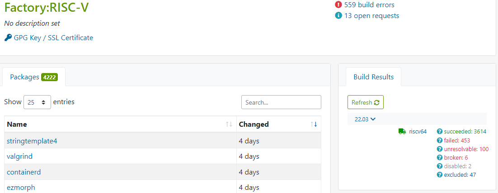
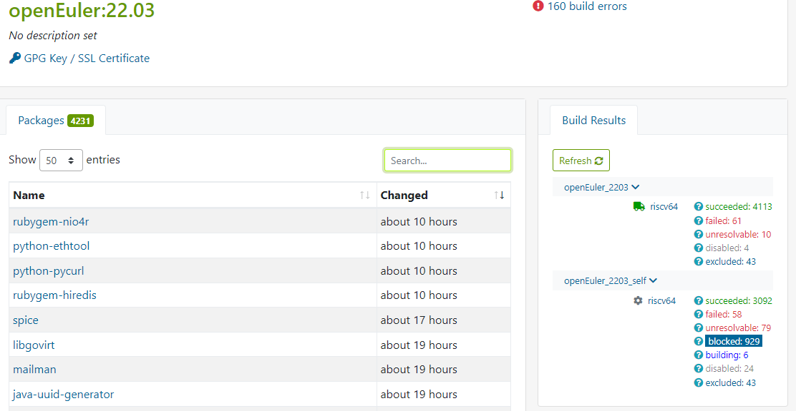
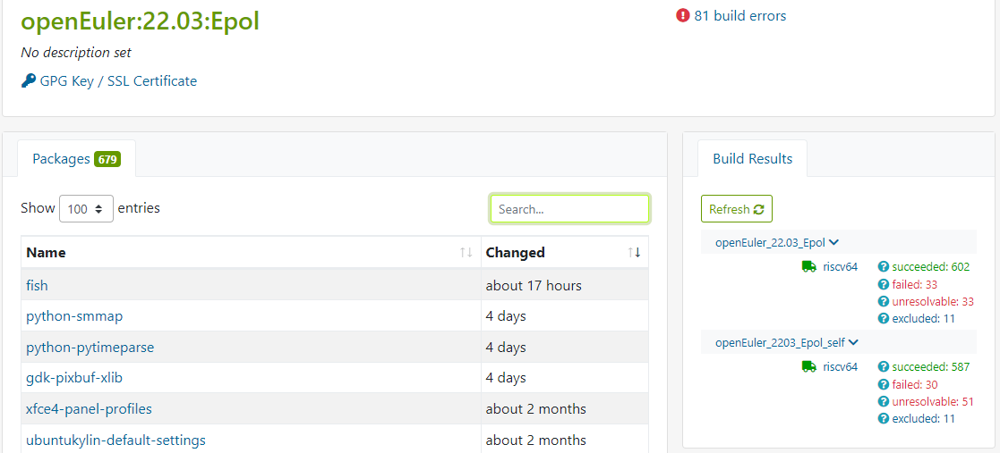
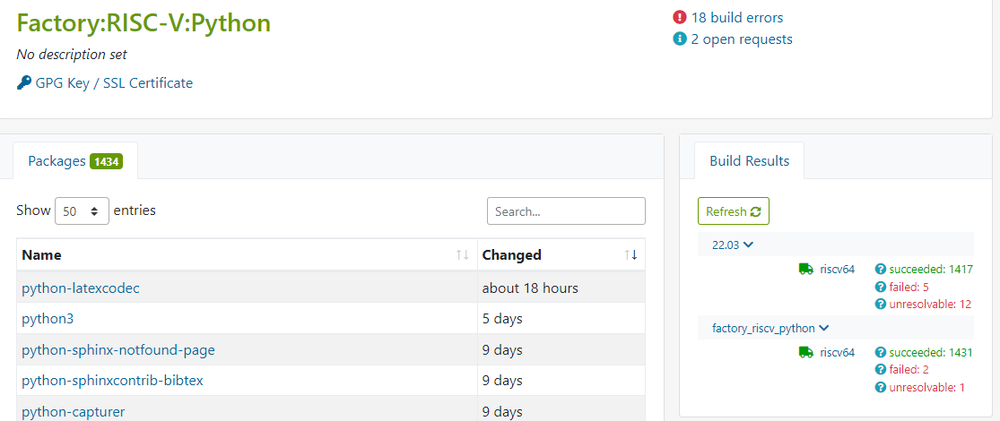
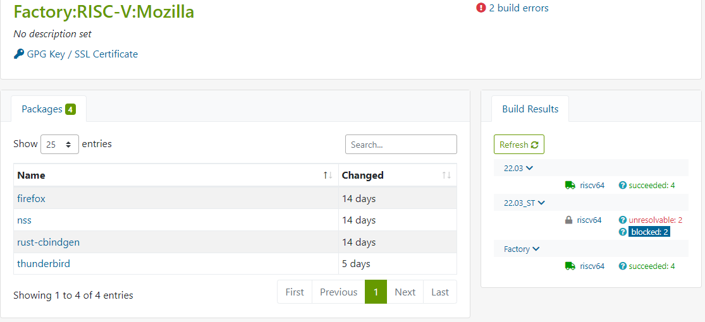
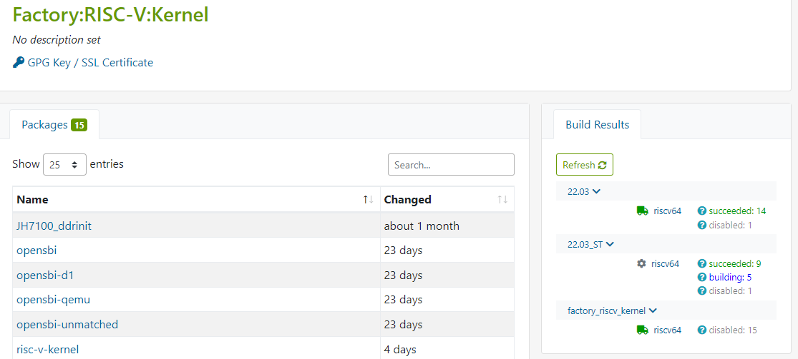

# openEuler RISC-V 开源操作系统进展·第008期·2022年06月16日

## 卷首语

## 本期亮点

### 新增PR：+21个

| rvPRUser    | packageName              | rvPRStatus | rvPRUrl                                                      | created_at          |
| ----------- | ------------------------ | ---------- | ------------------------------------------------------------ | ------------------- |
| HKGY        | perl-Alien-Build         | open       | https://gitee.com/openEuler-RISC-V/perl-Alien-Build/pulls/1  | 2022-06-09 05:07:11 |
| HKGY        | perl-Archive-Zip         | open       | https://gitee.com/openEuler-RISC-V/perl-Archive-Zip/pulls/1  | 2022-06-15 09:46:55 |
| jchzhou     | pulseaudio               | merged     | https://gitee.com/openEuler-RISC-V/pulseaudio/pulls/3        | 2022-06-07 21:14:49 |
| Jingwiw     | openmpi                  | merged     | https://gitee.com/openEuler-RISC-V/openmpi/pulls/3           | 2022-06-09 15:22:13 |
| Jingwiw     | thunderbird              | merged     | https://gitee.com/openEuler-RISC-V/thunderbird/pulls/1       | 2022-06-02 14:51:39 |
| laokz       | apache-commons-beanutils | open       | https://gitee.com/openEuler-RISC-V/apache-commons-beanutils/pulls/1 | 2022-06-07 14:36:20 |
| laokz       | apache-poi               | open       | https://gitee.com/openEuler-RISC-V/apache-poi/pulls/1        | 2022-06-07 14:51:04 |
| laokz       | codenarc                 | open       | https://gitee.com/openEuler-RISC-V/codenarc/pulls/1          | 2022-06-09 18:41:52 |
| laokz       | mockito                  | merged     | https://gitee.com/openEuler-RISC-V/mockito/pulls/1           | 2022-06-07 15:09:06 |
| misaka00251 | dde-api                  | merged     | https://gitee.com/openEuler-RISC-V/dde-api/pulls/1           | 2022-06-10 23:26:58 |
| misaka00251 | dde-daemon               | merged     | https://gitee.com/openEuler-RISC-V/dde-daemon/pulls/1        | 2022-06-10 23:28:37 |
| misaka00251 | dde-file-manager         | merged     | https://gitee.com/openEuler-RISC-V/dde-file-manager/pulls/1  | 2022-06-10 23:30:31 |
| misaka00251 | deepin-desktop-base      | merged     | https://gitee.com/openEuler-RISC-V/deepin-desktop-base/pulls/1 | 2022-06-10 23:31:41 |
| misaka00251 | nodejs-async             | merged     | https://gitee.com/openEuler-RISC-V/nodejs-async/pulls/3      | 2022-06-09 16:54:56 |
| misaka00251 | startdde                 | merged     | https://gitee.com/openEuler-RISC-V/startdde/pulls/1          | 2022-06-10 23:32:31 |
| SEmmmer     | lldb                     | merged     | https://gitee.com/openEuler-RISC-V/lldb/pulls/1              | 2022-06-09 16:04:31 |
| YukariChiba | clibcni                  | open       | https://gitee.com/openEuler-RISC-V/clibcni/pulls/3           | 2022-06-11 17:27:14 |
| YukariChiba | lcr                      | open       | https://gitee.com/openEuler-RISC-V/lcr/pulls/3               | 2022-06-11 17:21:25 |
| YukariChiba | nano                     | open       | https://gitee.com/openEuler-RISC-V/nano/pulls/3              | 2022-06-12 00:35:20 |
| YukariChiba | valgrind                 | merged     | https://gitee.com/openEuler-RISC-V/valgrind/pulls/4          | 2022-06-11 13:26:58 |
| zxs-un      | risc-v-kernel            | merged     | https://gitee.com/openEuler-RISC-V/risc-v-kernel/pulls/7     | 2022-06-07 02:15:11 |

### OBS构建工程进展

- [Factory:RISC-V](https://build.tarsier-infra.com/project/show/Factory:RISC-V) ：3614/4222   +40/+20

  

- [openEuler:22.03](https://build.tarsier-infra.com/project/show/openEuler:22.03) ：4113/4231  0/+28

  - 自构建仓库[openEuler_2203_self](https://build.tarsier-infra.com/project/repository_state/openEuler:22.03/openEuler_2203_self)     3092/4231

  

  

  

- [openEuler:22.03:Epol](https://build.tarsier-infra.com/project/show/openEuler:22.03:Epol) : 602/679  +3/0

  

- [Factory:RISC-V:Python](https://build.tarsier-infra.com/project/show/Factory:RISC-V:Python) : 1431/1434  +5/0

  

- [Factory:RISC-V:Mozilla](https://build.tarsier-infra.com/project/show/Factory:RISC-V:Mozilla) : 4/4   +1/+1

  

  

  

- [Factory:RISC-V:Kernel](https://build.tarsier-infra.com/project/show/Factory:RISC-V:Kernel)：15/15

  - 增加22.03_ST 仓库，以openeuler_22.03_self作为依赖构建

  
  
  

### RISC-V 软件源&每日镜像计划

- 每日镜像CI已经正常运行，进入完善和优化阶段：qemu镜像音频驱动补充
- [仓库目录结构说明](https://gitee.com/phoebe-xi/rv-oe_work/blob/master/doc/develop%20process.md)

### 测试

- [22.03需求](https://gitee.com/phoebe-xi/rv-oe_work/blob/master/doc/22.03/requirements.md)
- [22.09需求](https://gitee.com/phoebe-xi/rv-oe_work/blob/master/doc/22.09/requirements.md)
- [测试策略](https://gitee.com/phoebe-xi/rv-oe_work/blob/master/doc/openEuler%20for%20RISC-V%20%E6%B5%8B%E8%AF%95%E7%AD%96%E7%95%A5.md)

## 可见交付

### Eustace

#### 基准版本试建构通过，上载已升级软件版本
- https://build.tarsier-infra.com/package/show/home:Eustace:Browsers/chromium?rev=3
- https://build.tarsier-infra.com/package/show/home:Eustace:Browsers/firefox?rev=2

（大部分功能此时应当可用）

