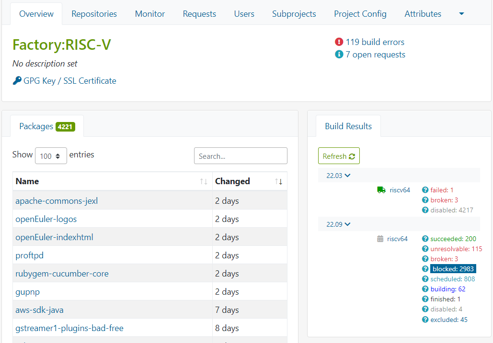
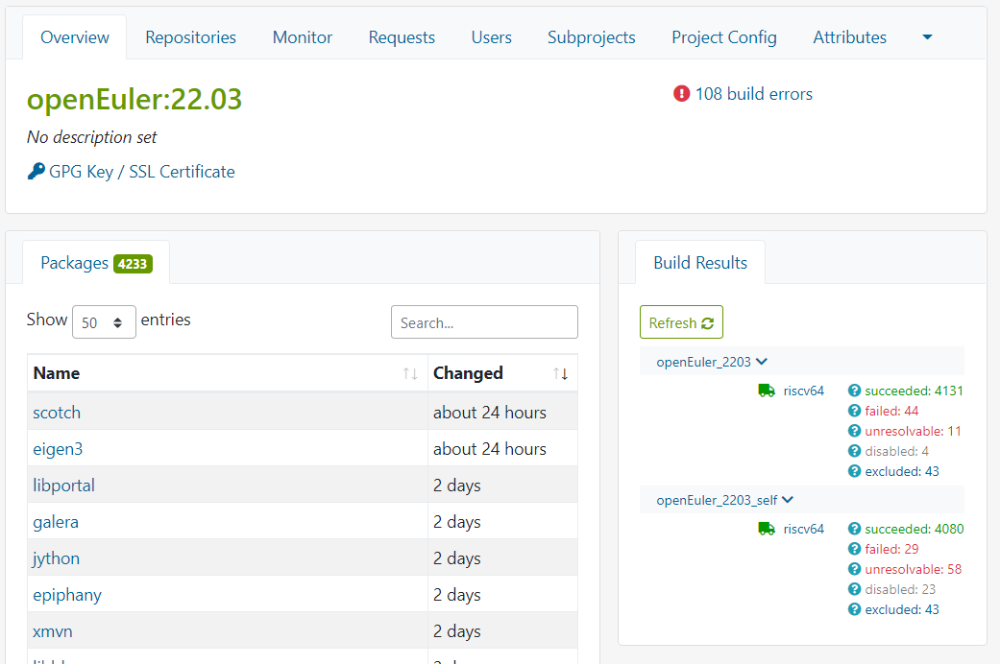
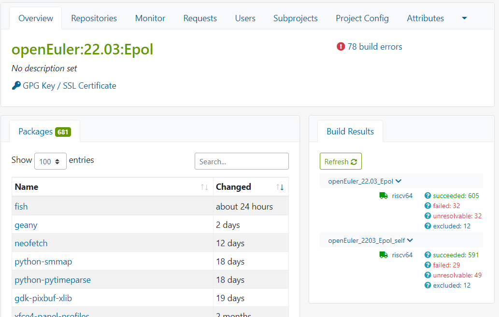
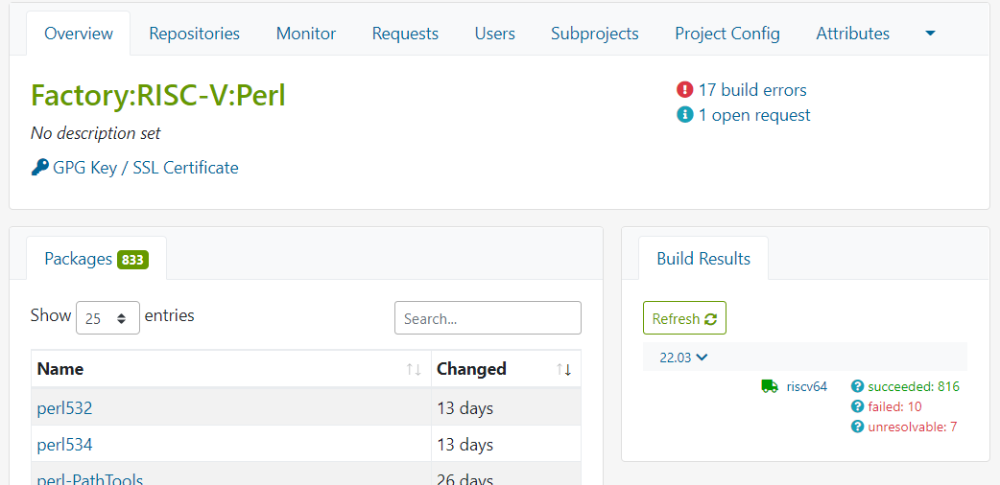
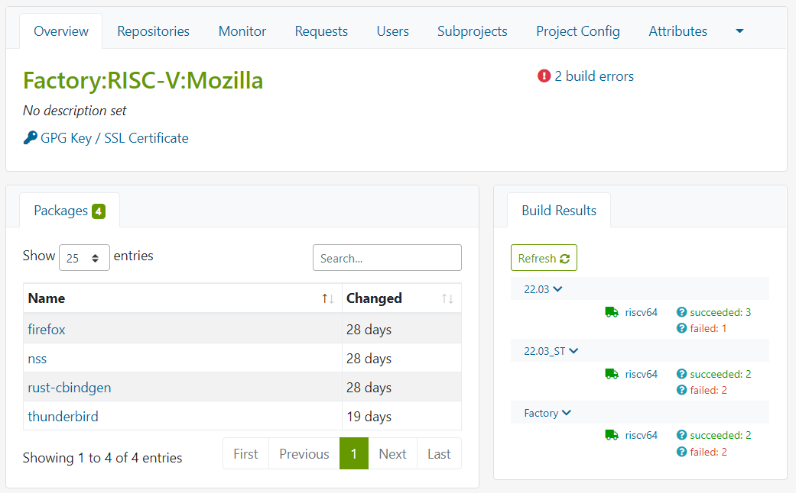
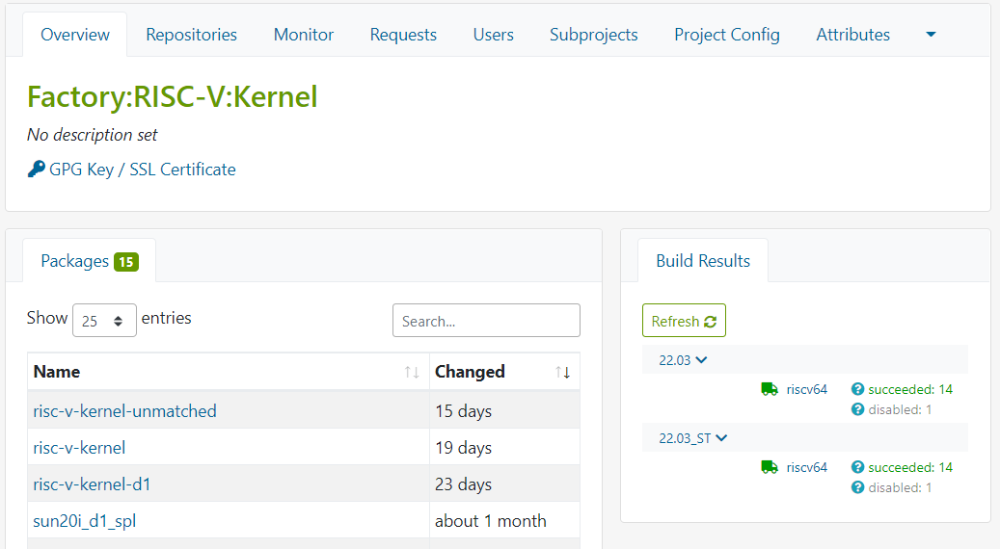

# openEuler RISC-V 开源操作系统进展·第009期·2022年06月30日

## 卷首语

## 本期亮点

### 新增PR：+23个

| rvPRUser    | packageName                    | rvPRStatus | rvPRUrl                                                      | created_at          |
| ----------- | ------------------------------ | ---------- | ------------------------------------------------------------ | ------------------- |
| laokz       | squid                          | open       | https://gitee.com/openEuler-RISC-V/squid/pulls/1             | 2022-06-16 21:26:27 |
| lvxiaoqian  | batik                          | open       | https://gitee.com/openEuler-RISC-V/batik/pulls/1             | 2022-06-16 14:15:37 |
| lvxiaoqian  | eclipse-ecf                    | open       | https://gitee.com/openEuler-RISC-V/eclipse-ecf/pulls/1       | 2022-06-16 14:13:18 |
| YukariChiba | annobin                        | open       | https://gitee.com/openEuler-RISC-V/annobin/pulls/1           | 2022-06-22 23:09:55 |
| YukariChiba | gsm                            | open       | https://gitee.com/openEuler-RISC-V/gsm/pulls/1               | 2022-06-22 23:10:39 |
| YukariChiba | gssproxy                       | open       | https://gitee.com/openEuler-RISC-V/gssproxy/pulls/1          | 2022-06-22 23:12:38 |
| YukariChiba | gzip                           | open       | https://gitee.com/openEuler-RISC-V/gzip/pulls/1              | 2022-06-22 23:11:16 |
| YukariChiba | htop                           | open       | https://gitee.com/openEuler-RISC-V/htop/pulls/1              | 2022-06-22 23:17:48 |
| YukariChiba | iproute                        | open       | https://gitee.com/openEuler-RISC-V/iproute/pulls/1           | 2022-06-22 23:18:17 |
| YukariChiba | mrtg                           | open       | https://gitee.com/openEuler-RISC-V/mrtg/pulls/1              | 2022-06-22 23:15:39 |
| YukariChiba | mtools                         | open       | https://gitee.com/openEuler-RISC-V/mtools/pulls/1            | 2022-06-22 23:14:21 |
| YukariChiba | pinentry                       | open       | https://gitee.com/openEuler-RISC-V/pinentry/pulls/1          | 2022-06-22 23:16:13 |
| YukariChiba | pv                             | open       | https://gitee.com/openEuler-RISC-V/pv/pulls/1                | 2022-06-22 23:16:53 |
| YukariChiba | unrtf                          | open       | https://gitee.com/openEuler-RISC-V/unrtf/pulls/1             | 2022-06-22 23:17:22 |
| Jingwiw     | fish                           | merged     | https://gitee.com/openEuler-RISC-V/fish/pulls/1              | 2022-06-27 12:55:38 |
| lvxiaoqian  | eigen3                         | merged     | https://gitee.com/openEuler-RISC-V/eigen3/pulls/1            | 2022-06-16 17:48:49 |
| lvxiaoqian  | python-btrfs                   | merged     | https://gitee.com/openEuler-RISC-V/python-btrfs/pulls/1      | 2022-06-16 14:08:01 |
| lvxiaoqian  | python-latexcodec              | merged     | https://gitee.com/openEuler-RISC-V/python-latexcodec/pulls/1 | 2022-06-27 16:55:10 |
| lvxiaoqian  | scotch                         | merged     | https://gitee.com/openEuler-RISC-V/scotch/pulls/1            | 2022-06-16 14:11:06 |
| misaka00251 | deepin-clone                   | merged     | https://gitee.com/openEuler-RISC-V/deepin-clone/pulls/1      | 2022-06-16 17:44:21 |
| YukariChiba | mksh                           | merged     | https://gitee.com/openEuler-RISC-V/mksh/pulls/1              | 2022-06-22 23:13:38 |
| YukariChiba | mobile-broadband-provider-info | merged     | https://gitee.com/openEuler-RISC-V/mobile-broadband-provider-info/pulls/1 | 2022-06-22 23:13:04 |
| YukariChiba | physfs                         | merged     | https://gitee.com/openEuler-RISC-V/physfs/pulls/1            | 2022-06-22 23:11:55 |

### OBS构建工程进展

- [Factory:RISC-V](https://build.tarsier-infra.com/project/show/Factory:RISC-V) ：3614/4222   

  - 更新软件包版本到master最新 [详情](https://gitee.com/phoebe-xi/rv-oe_work/issues/I5CLFM)   （存在后续master更新后持续更新问题）
  
  
  
  

- [openEuler:22.03](https://build.tarsier-infra.com/project/show/openEuler:22.03) ：4131/4233  18/+2

  - [openEuler_2203](https://build.tarsier-infra.com/project/repository_state/openEuler:22.03/openEuler_2203)是第一次滚动 产生尽可能多的包做seed					**4131**
  - [openEuler_2203_self](https://build.tarsier-infra.com/project/repository_state/openEuler:22.03/openEuler_2203_self)  是第二次滚动 进行纯净的编译，并且构建包依赖升到当前版本		**4080**
  - openEuler_2203_rel 是第三次滚动 自身编译自身（todo，等待[openEuler_2203](https://build.tarsier-infra.com/project/repository_state/openEuler:22.03/openEuler_2203)failed包解决）

  

  

  

  

- [openEuler:22.03:Epol](https://build.tarsier-infra.com/project/show/openEuler:22.03:Epol) : 605/681  +3/+2

  

  

​		

​		

- [Factory:RISC-V:Python](https://build.tarsier-infra.com/project/show/Factory:RISC-V:Python) : 1430/1434  +4/0

  
  
  

- [Factory:RISC-V:Perl](https://build.tarsier-infra.com/project/show/Factory:RISC-V:Perl)

  - Perl升级：5.28 to 5.34
  
  
  

- [Factory:RISC-V:Mozilla](https://build.tarsier-infra.com/project/show/Factory:RISC-V:Mozilla) : 4/4   -1/+1

  

  

  

  

- [Factory:RISC-V:Kernel](https://build.tarsier-infra.com/project/show/Factory:RISC-V:Kernel)：15/15

  - 22.03_ST 仓库，以openeuler_22.03_self作为依赖构建完成

  

  
  
  

### RISC-V 软件源&每日镜像计划

- 每日镜像CI已经正常运行，进入完善和优化阶段：qemu镜像音频驱动补充

- [软件源说明](https://gitee.com/openeuler/RISC-V/blob/master/doc/tutorials/rpm-repository.md)

  

### 测试/验证

- [ORSP005 openEuler RISC-V 测试规范](https://gitee.com/yunxiangluo/RISC-V_1/blob/master/proposal/ORSP005.md)    附加规范[《openEuler RISC-V的系统镜像和源的基本可用性定义》](https://gitee.com/yunxiangluo/RISC-V_1/blob/master/proposal/openEuler RISC-V的系统镜像和源的基本可用性定义.md)
- [openEuler 22.03 RISC-V版本Firefox特性测试](https://github.com/YunxiangLuo/testing/blob/main/Firefox/README.md)
- [openEuler 22.03 RISC-V版本Thunderbird特性测试](https://github.com/YunxiangLuo/testing/blob/main/Thunderbird/README.md)

- [Verify firefox for openeuler on visionfive](https://gitee.com/samuel_yuan/riscv-openeuler-visionfive/blob/master/chapter2-Verify-openeuler-GUI-APP-on-visionfive/Verify-firefox-for-openeuler-on-visionfive.md)   @samuel_yuan

- [Verify sdlquake for openeuler on visionfive](https://gitee.com/samuel_yuan/riscv-openeuler-visionfive/blob/master/chapter2-Verify-openeuler-GUI-APP-on-visionfive/Verify-sdlquake-for-openeuler-on-visionfive.md) @samuel_yuan

## 可见交付

