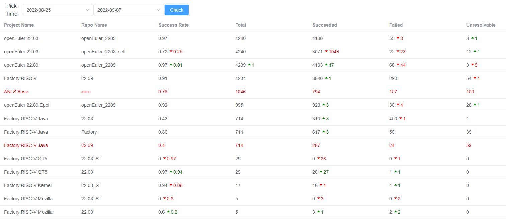

# openEuler RISC-V 开源操作系统进展·第014期·2022年09月08日

## 卷首语

openEuler riscv架构的适配，已经基本完成了mainline核心包的适配工作，欧拉社区的mainline外的其他包也已经纳入到构建范围，openEuler 22.09版本构建修包进行中。

本阶段工作重点依然是3个方向：

- 社区版本计划：openEuler:22.09工程的构建与问题解决；

- 软件包版本升级：社区小伙伴们将一些软件包的版本进行升级，部分超前社区升级的软件包PR提交到src-openeuler仓库；这些PR状态需要持续跟踪；

- 新功能/新特性：为了准备2022 RISC-V中国峰会，openeuler将之前适配的一些软件包进行了加速整理，未进行测试的新增适配软件包有：

  - 桌面：DDE、KDE
  - chromium
  - VLC
  - eclipse
  - LibreOffice

  

  针对这些新适配的应用，需要：

  1. 开发人员需要做：

     - 提交PR到中间仓；

     - 软件包加入到obs公共工程中进行构建出包（在obs中创建工程或者新增软件包、或者更新软件包的url和revision），方便后续镜像生成；
  2. 仓库管理员：上述软件包需要在22.09的镜像仓库中有安装包
  3. 测试：对新适配软件包进行测试；（在测试镜像ready之前，可先准备好测试用例）

## 本期亮点

## 适配进展

### 总体进度 

|                  | 编译成功包数量 | 总数量 | 包成功比 |
| ---------------- | -------------- | ------ | -------- |
| 核心包           | 4141           | 4236   | 97%      |
| 扩展包           | 2355           | 4269   | 55%      |
| 三方包（未开始） |                |        |          |

> 统计说明：
>
> - 核心包：[openEuler:Mainline](https://build.tarsier-infra.com/project/show/openEuler:Mainline) 对应的包
>
> - 扩展包：[openEuler:Epol](https://build.tarsier-infra.com/project/show/openEuler:Epol) +  [openEuler:Factory](https://build.tarsier-infra.com/project/show/openEuler:Factory) ； [Factory:RISC-V ](https://build.tarsier-infra.com/project/show/Factory:RISC-V) 以及Factory:RISC-V:XXX系列 软件包还未计入扩展包范围（有重复包）；需要定义扩展包对应的管理工程，并对工程及软件包进行整理，在2209构建完成后开展。
> - 三方包：未开始

| OBS工程名                 | 仓库名                   | 工程状态 | 成功百分比 | 软件包总数 | succeeded | failed | unresolvable |
| ------------------------- | ------------------------ | -------- | ---------- | ---------- | --------- | ------ | ------------ |
| openEuler:22.03           | openEuler_2203_self      |          | 0.72       | 4240       | 3071      | 22     | 12           |
| openEuler:22.03:Epol      | openEuler_2203_Epol_self | building | 0.9        | 682        | 614       | 18     | 39           |
| openEuler:22.03           | openEuler_2203           |          | 0.97       | 4240       | 4130      | 55     | 3            |
| openEuler:22.03:Epol      | openEuler_22.03_Epol     |          | 0.91       | 682        | 620       | 27     | 24           |
| openEuler:22.09           | openEuler_2209           |          | 0.97       | 4239       | 4103      | 68     | 8            |
| openEuler:22.09:Epol      | openEuler_2209           |          | 0.92       | 995        | 920       | 36     | 28           |
| openEuler:Mainline        | standard                 |          | 0.9        | 4217       | 3779      | 320    | 65           |
| openEuler:Epol            | standard                 |          | 0.85       | 1023       | 868       | 36     | 102          |
| openEuler:Factory         | standard                 |          | 0.46       | 3246       | 1487      | 143    | 179          |
| Factory:RISC-V            | 22.09                    |          | 0.91       | 4234       | 3840      | 290    | 54           |
| Factory:RISC-V            | 22.03                    |          | 0          | 4234       | 1         | 0      | 0            |
| Factory:RISC-V:Python3.10 | 22.03                    |          | 1          | 1455       | 1448      | 3      | 2            |
| Factory:RISC-V:Python     | factory_riscv_python     |          | 0          | 1433       | 0         | 0      | 0            |
| Factory:RISC-V:Python     | 22.03                    |          | 1          | 1433       | 1431      | 2      | 0            |
| Factory:RISC-V:Perl       | 22.03                    |          | 0.98       | 833        | 815       | 10     | 7            |
| Factory:RISC-V:Java       | Factory                  |          | 0.86       | 714        | 617       | 56     | 39           |
| Factory:RISC-V:Java       | 22.09                    |          | 0.4        | 714        | 287       | 24     | 59           |
| Factory:RISC-V:Java       | 22.03                    |          | 0.43       | 714        | 310       | 400    | 1            |
| Factory:RISC-V:Nodejs     | factory_riscv_nodejs     |          | 1          | 338        | 337       | 1      | 0            |
| Factory:RISC-V:Nodejs     | 22.03                    |          | 1          | 338        | 338       | 0      | 0            |
| Factory:RISC-V:Ruby       | factory_riscv_ruby       |          | 0.81       | 219        | 177       | 42     | 0            |
| Factory:RISC-V:Ruby       | 22.03                    |          | 0.86       | 219        | 188       | 31     | 0            |
| Factory:RISC-V:KDE        | 2209                     |          | 0.98       | 176        | 173       | 0      | 3            |
| Factory:RISC-V:KDE        | 2203                     |          | 0.98       | 176        | 173       | 0      | 3            |
| Factory:RISC-V:QT5        | Factory                  |          | 1          | 29         | 29        | 0      | 0            |
| Factory:RISC-V:QT5        | 22.09                    |          | 0.97       | 29         | 28        | 1      | 0            |
| Factory:RISC-V:QT5        | 22.03_ST                 |          | 0          | 29         | 0         | 0      | 0            |
| Factory:RISC-V:QT5        | 22.03                    |          | 0.97       | 29         | 28        | 1      | 0            |
| Factory:RISC-V:Ocaml      | 22.03                    |          | 1          | 19         | 19        | 0      | 0            |
| Factory:RISC-V:Erlang     | Factory                  |          | 1          | 17         | 17        | 0      | 0            |
| Factory:RISC-V:Kernel     | 22.09                    |          | 1          | 17         | 17        | 0      | 0            |
| Factory:RISC-V:Kernel     | 22.03_ST                 |          | 0.94       | 17         | 16        | 1      | 0            |
| Factory:RISC-V:Kernel     | 22.03                    |          | 1          | 17         | 17        | 0      | 0            |
| Factory:RISC-V:Mozilla    | Factory                  |          | 0.8        | 5          | 4         | 1      | 0            |
| Factory:RISC-V:Mozilla    | 22.09                    |          | 0.6        | 5          | 3         | 2      | 0            |
| Factory:RISC-V:Mozilla    | 22.03_ST                 |          | 0          | 5          | 0         | 0      | 0            |
| Factory:RISC-V:Mozilla    | 22.03                    |          | 0.6        | 5          | 3         | 2      | 0            |
| Factory:RISC-V:Rust       | rust1.58                 |          | 0          | 2          | 0         | 0      | 2            |
| Factory:RISC-V:Extra      | 22.09                    |          | 1          | 1          | 1         | 0      | 0            |
| Factory:RISC-V:Extra      | 22.03                    |          | 1          | 1          | 1         | 0      | 0            |

说明：

- **Factory:RISC-V:Java**的软件包，构建成功率低，可以分析推进下
- **Factory:RISC-V:Rust：目前22.09中rust版本为1.60 ，工程中貌似还不存在该版本？**

- openEuler:Factory 构建成功率低是由于有1434个包excluded，这些包源码仓部分为空，或者源码存在问题。解决优先级低，后续按需对需要的包逐步解决。

### 中间仓新增PR：+28个

| rvPRUser    | packageName             | rvPRStatus | rvPRUrl                                                      | created_at          |
| ----------- | ----------------------- | ---------- | ------------------------------------------------------------ | ------------------- |
| Alex Rain   | fakeroot                | merged     | https://gitee.com/openEuler-RISC-V/fakeroot/pulls/2          | 2022-08-31 09:54:04 |
| HKGY        | python-mnemonic         | open       | https://gitee.com/openEuler-RISC-V/python-mnemonic/pulls/1   | 2022-08-31 11:39:46 |
| HKGY        | python-pyTelegramBotAPI | open       | https://gitee.com/openEuler-RISC-V/python-pyTelegramBotAPI/pulls/2 | 2022-09-01 01:26:53 |
| HKGY        | nano                    | merged     | https://gitee.com/openEuler-RISC-V/nano/pulls/4              | 2022-08-31 20:14:29 |
| HKGY        | python-ddt              | merged     | https://gitee.com/openEuler-RISC-V/python-ddt/pulls/1        | 2022-09-03 16:55:19 |
| HKGY        | python-dpkt             | merged     | https://gitee.com/openEuler-RISC-V/python-dpkt/pulls/1       | 2022-09-06 00:35:49 |
| HKGY        | python-limits           | merged     | https://gitee.com/openEuler-RISC-V/python-limits/pulls/1     | 2022-08-26 14:00:40 |
| HKGY        | python-lmdb             | merged     | https://gitee.com/openEuler-RISC-V/python-lmdb/pulls/1       | 2022-08-27 14:38:52 |
| HKGY        | python-mne              | merged     | https://gitee.com/openEuler-RISC-V/python-mne/pulls/1        | 2022-08-29 02:40:58 |
| HKGY        | python-mne-bids         | merged     | https://gitee.com/openEuler-RISC-V/python-mne-bids/pulls/1   | 2022-08-31 11:47:48 |
| jchzhou     | gstreamer1              | open       | https://gitee.com/openEuler-RISC-V/gstreamer1/pulls/1        | 2022-09-02 15:13:13 |
| jchzhou     | gstreamer1-plugins-base | open       | https://gitee.com/openEuler-RISC-V/gstreamer1-plugins-base/pulls/2 | 2022-09-02 15:48:59 |
| jchzhou     | pipewire                | merged     | https://gitee.com/openEuler-RISC-V/pipewire/pulls/2          | 2022-08-29 19:54:54 |
| jchzhou     | risc-v-kernel           | merged     | https://gitee.com/openEuler-RISC-V/risc-v-kernel/pulls/10    | 2022-08-25 23:16:01 |
| misaka00251 | dde-file-manager        | open       | https://gitee.com/openEuler-RISC-V/dde-file-manager/pulls/2  | 2022-08-30 11:14:00 |
| misaka00251 | accumulo                | merged     | https://gitee.com/openEuler-RISC-V/accumulo/pulls/1          | 2022-09-01 16:39:04 |
| misaka00251 | dde-file-manager        | merged     | https://gitee.com/openEuler-RISC-V/dde-file-manager/pulls/3  | 2022-08-30 13:37:54 |
| misaka00251 | deepin-editor           | merged     | https://gitee.com/openEuler-RISC-V/deepin-editor/pulls/1     | 2022-08-29 14:25:38 |
| YukariChiba | samba                   | open       | https://gitee.com/openEuler-RISC-V/samba/pulls/2             | 2022-08-25 23:50:30 |
| YukariChiba | clibcni                 | merged     | https://gitee.com/openEuler-RISC-V/clibcni/pulls/4           | 2022-08-27 13:26:13 |
| YukariChiba | lcr                     | merged     | https://gitee.com/openEuler-RISC-V/lcr/pulls/4               | 2022-08-26 15:32:36 |
| YukariChiba | libldb                  | merged     | https://gitee.com/openEuler-RISC-V/libldb/pulls/1            | 2022-08-25 02:53:35 |
| YukariChiba | libtalloc               | merged     | https://gitee.com/openEuler-RISC-V/libtalloc/pulls/1         | 2022-08-25 02:54:31 |
| YukariChiba | libtdb                  | merged     | https://gitee.com/openEuler-RISC-V/libtdb/pulls/1            | 2022-08-25 02:54:04 |
| YukariChiba | libtevent               | merged     | https://gitee.com/openEuler-RISC-V/libtevent/pulls/1         | 2022-08-25 02:54:57 |
| YukariChiba | lxc                     | merged     | https://gitee.com/openEuler-RISC-V/lxc/pulls/3               | 2022-08-27 13:33:28 |
| YukariChiba | maildrop                | merged     | https://gitee.com/openEuler-RISC-V/maildrop/pulls/1          | 2022-08-27 13:27:52 |
| YukariChiba | vdo                     | merged     | https://gitee.com/openEuler-RISC-V/vdo/pulls/3               | 2022-08-29 17:22:26 |

### src-openeuler仓库PR

统计数据详见：[OERV-PR跟踪](https://docs.qq.com/sheet/DUEtoYmZLcmFaWWl3?tab=uy6nk1) 

- 中间仓 43个PR open；

- src-oe 113个PR open；

> 数据的抓取按照giteeid执行，如果发现统计数据少了自己的，可联系我添加
>
> 工具：https://github.com/isrc-cas/tarsier-oerv/tree/main/scripts/GiteePRTracker 

- texlive、R系列PR：240个 详见：https://docs.qq.com/sheet/DZFpWc3NicUtNSXln?tab=BB08J2

### 开源社区PR

这里指软件包开源仓库(非linux发行版包仓库)。由于软件包范围广，难以使用工具跟踪，需要各贡献者自己填写。

大家可以将提交到上游开源社区的PR登记在这里：[上游社区PR跟踪](https://docs.qq.com/sheet/DUFhSa3pRRUdveXVj?tab=BB08J2)

### 软件包进展维护

以软件包进入测试范围为目标，邀请一起维护 [软件包适配进度跟踪](https://docs.qq.com/sheet/DUHdRc0piQVBpYVla?tab=BB08J2)

## 可见交付(成员补充)

