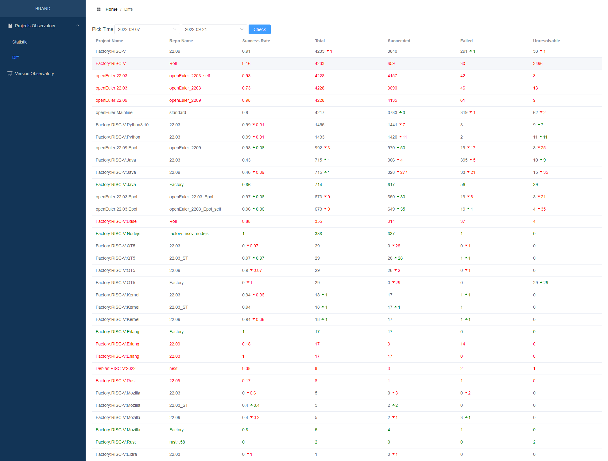

# openEuler RISC-V 开源操作系统进展·第015期·2022年09月22日

## 卷首语
openEuler riscv架构的适配，已经基本完成了mainline核心包的适配工作，欧拉社区的mainline外的其他包也已经纳入到构建范围。

本阶段工作重点依然是3个方向：

- 社区版本计划：openEuler:22.09版本发布准备；

- 软件包版本升级：社区小伙伴们将一些软件包的版本进行升级，部分超前社区升级的软件包PR提交到src-openeuler仓库；这些PR状态需要持续跟踪；

- 新功能/新特性：在oerv增加适配过程中，一些新的软件包仓库在欧拉社区创建，并由risc-v sig维护；

## 本期亮点
1. kernel：
   - Add package for building opensbi+uboot payload (for qemu)
   - Add u-boot.bin to package for building opensbi+uboot payload
2. 在欧拉社区新增82个包仓库
3. LibreOffice及依赖软件包梳理完成
4. eclipse 提交non-bootstrap for riscv64

## 适配进展

|                  | 编译成功包数量 | 总数量 | 包成功比 |
| ---------------- | -------------- | ------ | -------- |
| 核心包           | 4141           | 4236   | 97%      |
| 扩展包           | 2355           | 4269   | 55%      |
| 三方包（未开始） |                |        |          |

> 统计说明：
>
> - 核心包：[openEuler:Mainline](https://build.tarsier-infra.com/project/show/openEuler:Mainline) 对应的包
>
> - 扩展包：[openEuler:Epol](https://build.tarsier-infra.com/project/show/openEuler:Epol) +  [openEuler:Factory](https://build.tarsier-infra.com/project/show/openEuler:Factory) ； [Factory:RISC-V ](https://build.tarsier-infra.com/project/show/Factory:RISC-V) 以及Factory:RISC-V:XXX系列 软件包还未计入扩展包范围（有重复包）；需要定义扩展包对应的管理工程，并对工程及软件包进行整理，在2209构建完成后开展。
> - 三方包：未开始

| OBS工程名                 | 仓库名                   | 工程状态 | 成功百分比 | 软件包总数 | succeeded | failed | unresolvable |
| ------------------------- | ------------------------ | -------- | ---------- | ---------- | --------- | ------ | ------------ |
| openEuler:22.03           | openEuler_2203_self      |          | 0.98320719  | 4228 | 4157 | 42   | 8    |
| openEuler:22.03           | openEuler_2203           | building | 0.730842006 | 4228 | 3090 | 46   | 13   |
| openEuler:22.03:Epol      | openEuler_2203_Epol_self |  | 0.964338782 | 673  | 649  | 19   | 4    |
| openEuler:22.03:Epol      | openEuler_22.03_Epol     |  | 0.965824666 | 673  | 650  | 19   | 3    |
| openEuler:22.09           | openEuler_2209           |          | 0.978003784 | 4228 | 4135 | 61   | 9    |
| openEuler:22.09:Epol      | openEuler_2209           |          | 0.977822581 | 992  | 970  | 19   | 3    |
| openEuler:Mainline        | standard                 |          | 0.897083235 | 4217 | 3783 | 319  | 62   |
| openEuler:Epol            | standard                 |          | 0.848484848 | 1023 | 868  | 36   | 102  |
| openEuler:Factory         | standard                 |          | 0.45810228  | 3246 | 1487 | 143  | 179  |
| Factory:RISC-V            | Roll                     |          | 0.15568155  | 4233 | 659  | 30   | 3496 |
| Factory:RISC-V            | 22.09                    |          | 0.907158044 | 4233 | 3840 | 291  | 53   |
| Factory:RISC-V:Base       | Roll                     |          | 0.884507042 | 355  | 314  | 37   | 4    |
| Factory:RISC-V:Erlang     | 22.09                    |          | 0.176470588 | 17   | 3    | 14   | 0    |
| Factory:RISC-V:Erlang     | 22.03                    |          | 1           | 17   | 17   | 0    | 0    |
| Factory:RISC-V:Extra      | 22.09                    |          | 1           | 1    | 1    | 0    | 0    |
| Factory:RISC-V:Extra      | 22.03                    |          | 0           | 1    | 0    | 0    | 0    |
| Factory:RISC-V:Java       | 22.09                    | building | 0.458741259 | 715  | 328  | 33   | 15   |
| Factory:RISC-V:Java       | 22.03                    |          | 0.427972028 | 715  | 306  | 395  | 10   |
| Factory:RISC-V:KDE        | 2209                     |          | 0.982954545 | 176  | 173  | 0    | 3    |
| Factory:RISC-V:KDE        | 2203                     |          | 0.982954545 | 176  | 173  | 0    | 3    |
| Factory:RISC-V:Kernel     | 22.09                    |          | 0.944444444 | 18   | 17   | 1    | 0    |
| Factory:RISC-V:Kernel     | 22.03_ST                 |          | 0.944444444 | 18   | 17   | 1    | 0    |
| Factory:RISC-V:Kernel     | 22.03                    |          | 0.944444444 | 18   | 17   | 1    | 0    |
| Factory:RISC-V:Mozilla    | 22.09                    |          | 0.4         | 5    | 2    | 3    | 0    |
| Factory:RISC-V:Mozilla    | 22.03_ST                 |          | 0.4         | 5    | 2    | 0    | 0    |
| Factory:RISC-V:Mozilla    | 22.03                    |          | 0           | 5    | 0    | 0    | 0    |
| Factory:RISC-V:Nodejs     | 22.03                    |          | 1           | 338  | 338  | 0    | 0    |
| Factory:RISC-V:Ocaml      | 22.03                    |          | 1           | 19   | 19   | 0    | 0    |
| Factory:RISC-V:Perl       | 22.03                    |          | 0.978391357 | 833  | 815  | 10   | 7    |
| Factory:RISC-V:Python     | factory_riscv_python     |          | 0           | 1433 | 0    | 0    | 0    |
| Factory:RISC-V:Python     | 22.03                    |          | 0.990928123 | 1433 | 1420 | 2    | 11   |
| Factory:RISC-V:Python3.10 | 22.03                    |          | 0.990378007 | 1455 | 1441 | 3    | 9    |
| Factory:RISC-V:QT5        | Factory                  |          | 0           | 29   | 0    | 0    | 29   |
| Factory:RISC-V:QT5        | 22.09                    |  | 0.896551724 | 29   | 26   | 0    | 0    |
| Factory:RISC-V:QT5        | 22.03_ST                 |          | 0.965517241 | 29   | 28   | 1    | 0    |
| Factory:RISC-V:QT5        | 22.03                    |          | 0           | 29   | 0    | 0    | 0    |
| Factory:RISC-V:Ruby       | factory_riscv_ruby       |          | 0.808219178 | 219  | 177  | 42   | 0    |
| Factory:RISC-V:Ruby       | 22.03                    |          | 0.858447489 | 219  | 188  | 31   | 0    |
| Factory:RISC-V:Rust       | 22.09                    |          | 0.166666667 | 6    | 1    | 1    | 0    |

说明：

- **Factory:RISC-V:Base**:新增
- Factory:RISC-V:Rust：目前22.09中rust版本为1.60 
- Kernel：Add package for building opensbi+uboot payload (for qemu)

### 新增PR：+103个

| 用户名         | 组织名           | 仓库名                   | 标题                                                         | 发起时间                  | 更新时间                  | 状态   | SIG                  | 请求链接                                                     |
| -------------- | ---------------- | ------------------------ | ------------------------------------------------------------ | ------------------------- | ------------------------- | ------ | -------------------- | ------------------------------------------------------------ |
| YukariChiba    | openeuler-risc-v | samba                    | Upgrade samba.                                               | 2022-09-08 13:56:23+08:00 | 2022-09-09 14:49:51+08:00 | merged |                      | https://gitee.com/openeuler-risc-v/samba/pulls/3             |
| YukariChiba    | openeuler-risc-v | annobin                  | Upgrade package                                              | 2022-09-19 14:13:36+08:00 | 2022-09-20 12:25:04+08:00 | open   |                      | https://gitee.com/openeuler-risc-v/annobin/pulls/2           |
| ptr_0f_invalid | openeuler-risc-v | bazel                    | Bump version to 4.2.1                                        | 2022-09-18 22:50:12+08:00 | 2022-09-21 15:57:20+08:00 | open   |                      | https://gitee.com/openeuler-risc-v/bazel/pulls/3             |
| ptr_0f_invalid | src-openeuler    | bazel                    | modify patch to build on riscv                               | 2022-09-18 23:14:25+08:00 | 2022-09-21 16:19:53+08:00 | open   | sig/ai               | https://gitee.com/src-openeuler/bazel/pulls/16               |
| misaka00251    | openeuler-risc-v | fcitx-libpinyin          | Fix build error                                              | 2022-09-13 15:46:38+08:00 | 2022-09-13 22:01:00+08:00 | merged |                      | https://gitee.com/openeuler-risc-v/fcitx-libpinyin/pulls/1   |
| misaka00251    | openeuler-risc-v | activemq                 | Fix build on OBS                                             | 2022-09-20 11:17:54+08:00 | 2022-09-20 12:18:19+08:00 | open   |                      | https://gitee.com/openeuler-risc-v/activemq/pulls/1          |
| misaka00251    | src-openeuler    | kf5-baloo                | Init package                                                 | 2022-09-07 17:21:08+08:00 | 2022-09-09 15:32:17+08:00 | open   | sig/sig-KDE          | https://gitee.com/src-openeuler/kf5-baloo/pulls/1            |
| misaka00251    | src-openeuler    | kf5-kfilemetadata        | Init package                                                 | 2022-09-07 17:23:16+08:00 | 2022-09-09 11:10:26+08:00 | merged | sig/sig-KDE          | https://gitee.com/src-openeuler/kf5-kfilemetadata/pulls/1    |
| misaka00251    | src-openeuler    | catdoc                   | Init package                                                 | 2022-09-07 17:24:33+08:00 | 2022-09-08 12:15:54+08:00 | merged | sig/sig-KDE          | https://gitee.com/src-openeuler/catdoc/pulls/1               |
| misaka00251    | src-openeuler    | ebook-tools              | Init package                                                 | 2022-09-07 17:27:42+08:00 | 2022-09-08 12:16:06+08:00 | merged | sig/sig-KDE          | https://gitee.com/src-openeuler/ebook-tools/pulls/1          |
| misaka00251    | src-openeuler    | kf5-kapidox              | Init package                                                 | 2022-09-07 17:30:23+08:00 | 2022-09-08 12:16:16+08:00 | merged | sig/sig-KDE          | https://gitee.com/src-openeuler/kf5-kapidox/pulls/1          |
| misaka00251    | src-openeuler    | kf5-kactivities-stats    | Init package                                                 | 2022-09-07 17:32:16+08:00 | 2022-09-07 17:42:47+08:00 | open   | sig/sig-KDE          | https://gitee.com/src-openeuler/kf5-kactivities-stats/pulls/1 |
| misaka00251    | src-openeuler    | kf5-kdav                 | Init package                                                 | 2022-09-07 17:34:22+08:00 | 2022-09-07 23:17:58+08:00 | open   | sig/sig-KDE          | https://gitee.com/src-openeuler/kf5-kdav/pulls/1             |
| misaka00251    | src-openeuler    | kf5-kcontacts            | Init package                                                 | 2022-09-07 17:46:30+08:00 | 2022-09-07 23:19:19+08:00 | open   | sig/sig-KDE          | https://gitee.com/src-openeuler/kf5-kcontacts/pulls/1        |
| misaka00251    | src-openeuler    | kf5-kdnssd               | Init package                                                 | 2022-09-07 17:49:37+08:00 | 2022-09-09 11:12:51+08:00 | merged | sig/sig-KDE          | https://gitee.com/src-openeuler/kf5-kdnssd/pulls/1           |
| misaka00251    | src-openeuler    | kf5-kholidays            | Init package                                                 | 2022-09-07 17:51:37+08:00 | 2022-09-08 12:16:27+08:00 | merged | sig/sig-KDE          | https://gitee.com/src-openeuler/kf5-kholidays/pulls/1        |
| misaka00251    | src-openeuler    | kdnssd                   | Init package                                                 | 2022-09-07 17:53:45+08:00 | 2022-09-21 13:11:03+08:00 | merged | sig/sig-KDE          | https://gitee.com/src-openeuler/kdnssd/pulls/1               |
| misaka00251    | src-openeuler    | kf5-kimageformats        | Init package                                                 | 2022-09-07 17:55:41+08:00 | 2022-09-09 11:12:34+08:00 | merged | sig/sig-KDE          | https://gitee.com/src-openeuler/kf5-kimageformats/pulls/1    |
| misaka00251    | src-openeuler    | kf5-kpeople              | Init package                                                 | 2022-09-07 17:59:42+08:00 | 2022-09-07 18:05:23+08:00 | open   | sig/sig-KDE          | https://gitee.com/src-openeuler/kf5-kpeople/pulls/1          |
| misaka00251    | src-openeuler    | kf5-kquickcharts         | Init package                                                 | 2022-09-07 18:54:24+08:00 | 2022-09-08 12:16:43+08:00 | merged | sig/sig-KDE          | https://gitee.com/src-openeuler/kf5-kquickcharts/pulls/1     |
| misaka00251    | src-openeuler    | kf5-modemmanager-qt      | Init package                                                 | 2022-09-07 18:56:58+08:00 | 2022-09-09 11:12:22+08:00 | merged | sig/sig-KDE          | https://gitee.com/src-openeuler/kf5-modemmanager-qt/pulls/1  |
| misaka00251    | src-openeuler    | oxygen-icon-theme        | Init package                                                 | 2022-09-07 19:17:38+08:00 | 2022-09-08 12:38:41+08:00 | merged | sig/sig-KDE          | https://gitee.com/src-openeuler/oxygen-icon-theme/pulls/1    |
| misaka00251    | src-openeuler    | kf5-prison               | Init package                                                 | 2022-09-07 19:21:23+08:00 | 2022-09-09 11:10:42+08:00 | merged | sig/sig-KDE          | https://gitee.com/src-openeuler/kf5-prison/pulls/1           |
| misaka00251    | src-openeuler    | libdmtx                  | Init package                                                 | 2022-09-07 19:27:59+08:00 | 2022-09-08 12:16:52+08:00 | merged | sig/sig-KDE          | https://gitee.com/src-openeuler/libdmtx/pulls/1              |
| misaka00251    | src-openeuler    | qqc2-desktop-style       | Init package                                                 | 2022-09-07 19:32:52+08:00 | 2022-09-07 19:40:07+08:00 | open   | sig/sig-KDE          | https://gitee.com/src-openeuler/qqc2-desktop-style/pulls/1   |
| misaka00251    | src-openeuler    | kf5-kjsembed             | Init package                                                 | 2022-09-07 19:37:10+08:00 | 2022-09-07 19:43:34+08:00 | open   | sig/sig-KDE          | https://gitee.com/src-openeuler/kf5-kjsembed/pulls/1         |
| misaka00251    | src-openeuler    | kf5-kmediaplayer         | Init package                                                 | 2022-09-07 19:39:27+08:00 | 2022-09-07 19:47:24+08:00 | open   | sig/sig-KDE          | https://gitee.com/src-openeuler/kf5-kmediaplayer/pulls/1     |
| misaka00251    | src-openeuler    | kf5-kross                | Init package                                                 | 2022-09-07 19:42:44+08:00 | 2022-09-07 19:50:15+08:00 | open   | sig/sig-KDE          | https://gitee.com/src-openeuler/kf5-kross/pulls/1            |
| misaka00251    | src-openeuler    | kf5-kxmlrpcclient        | Init package                                                 | 2022-09-07 19:45:38+08:00 | 2022-09-07 19:56:11+08:00 | open   | sig/sig-KDE          | https://gitee.com/src-openeuler/kf5-kxmlrpcclient/pulls/1    |
| misaka00251    | src-openeuler    | dolphin                  | Init package                                                 | 2022-09-07 19:49:23+08:00 | 2022-09-08 12:17:08+08:00 | merged | sig/sig-KDE          | https://gitee.com/src-openeuler/dolphin/pulls/1              |
| misaka00251    | src-openeuler    | kcron                    | Init package                                                 | 2022-09-07 19:53:57+08:00 | 2022-09-08 12:17:19+08:00 | merged | sig/sig-KDE          | https://gitee.com/src-openeuler/kcron/pulls/1                |
| misaka00251    | src-openeuler    | khelpcenter              | Init package                                                 | 2022-09-07 19:56:03+08:00 | 2022-09-21 13:07:59+08:00 | merged | sig/sig-KDE          | https://gitee.com/src-openeuler/khelpcenter/pulls/1          |
| misaka00251    | src-openeuler    | konsole5                 | Init package                                                 | 2022-09-07 19:58:17+08:00 | 2022-09-09 11:13:01+08:00 | merged | sig/sig-KDE          | https://gitee.com/src-openeuler/konsole5/pulls/1             |
| misaka00251    | src-openeuler    | kaccounts-integration    | Init package                                                 | 2022-09-07 20:00:07+08:00 | 2022-09-21 13:12:07+08:00 | merged | sig/sig-KDE          | https://gitee.com/src-openeuler/kaccounts-integration/pulls/1 |
| misaka00251    | src-openeuler    | libaccounts-qt           | Init package                                                 | 2022-09-07 20:02:26+08:00 | 2022-09-09 11:10:48+08:00 | merged | sig/sig-KDE          | https://gitee.com/src-openeuler/libaccounts-qt/pulls/1       |
| misaka00251    | src-openeuler    | libaccounts-glib         | Init package                                                 | 2022-09-07 20:04:24+08:00 | 2022-09-08 12:17:28+08:00 | merged | sig/sig-KDE          | https://gitee.com/src-openeuler/libaccounts-glib/pulls/1     |
| misaka00251    | src-openeuler    | kate                     | Init package                                                 | 2022-09-07 20:07:23+08:00 | 2022-09-08 00:21:40+08:00 | open   | sig/sig-KDE          | https://gitee.com/src-openeuler/kate/pulls/1                 |
| misaka00251    | src-openeuler    | kde-connect              | Init package                                                 | 2022-09-07 20:11:31+08:00 | 2022-09-09 15:27:48+08:00 | open   | sig/sig-KDE          | https://gitee.com/src-openeuler/kde-connect/pulls/1          |
| misaka00251    | src-openeuler    | libfakekey               | Init package                                                 | 2022-09-07 20:14:10+08:00 | 2022-09-08 12:17:42+08:00 | merged | sig/sig-KDE          | https://gitee.com/src-openeuler/libfakekey/pulls/1           |
| misaka00251    | src-openeuler    | kde-cli-tools            | Init package                                                 | 2022-09-07 20:16:38+08:00 | 2022-09-07 20:18:13+08:00 | open   | sig/sig-KDE          | https://gitee.com/src-openeuler/kde-cli-tools/pulls/1        |
| misaka00251    | src-openeuler    | kuserfeedback            | Init package                                                 | 2022-09-07 20:18:36+08:00 | 2022-09-08 12:18:03+08:00 | merged | sig/sig-KDE          | https://gitee.com/src-openeuler/kuserfeedback/pulls/1        |
| misaka00251    | src-openeuler    | signon                   | Init package                                                 | 2022-09-07 20:21:05+08:00 | 2022-09-08 12:18:25+08:00 | merged | sig/sig-KDE          | https://gitee.com/src-openeuler/signon/pulls/1               |
| misaka00251    | src-openeuler    | libqalculate             | Init package                                                 | 2022-09-07 20:24:24+08:00 | 2022-09-09 11:11:01+08:00 | merged | sig/sig-KDE          | https://gitee.com/src-openeuler/libqalculate/pulls/1         |
| misaka00251    | src-openeuler    | gpsd                     | Init package                                                 | 2022-09-07 20:27:14+08:00 | 2022-09-08 12:18:41+08:00 | merged | sig/sig-KDE          | https://gitee.com/src-openeuler/gpsd/pulls/1                 |
| misaka00251    | src-openeuler    | cln                      | Init package                                                 | 2022-09-07 20:34:47+08:00 | 2022-09-08 12:18:51+08:00 | merged | sig/sig-KDE          | https://gitee.com/src-openeuler/cln/pulls/1                  |
| misaka00251    | src-openeuler    | kf5-purpose              | Init package                                                 | 2022-09-07 20:37:31+08:00 | 2022-09-07 20:39:25+08:00 | open   | sig/sig-KDE          | https://gitee.com/src-openeuler/kf5-purpose/pulls/1          |
| misaka00251    | src-openeuler    | plasma-desktop           | Init package                                                 | 2022-09-07 20:42:19+08:00 | 2022-09-07 20:44:49+08:00 | open   | sig/sig-KDE          | https://gitee.com/src-openeuler/plasma-desktop/pulls/1       |
| misaka00251    | src-openeuler    | plasma-discover          | Init package                                                 | 2022-09-07 20:45:55+08:00 | 2022-09-21 13:11:39+08:00 | merged | sig/sig-KDE          | https://gitee.com/src-openeuler/plasma-discover/pulls/1      |
| misaka00251    | src-openeuler    | plasma-mediacenter       | Init package                                                 | 2022-09-07 20:50:04+08:00 | 2022-09-07 20:51:39+08:00 | open   | sig/sig-KDE          | https://gitee.com/src-openeuler/plasma-mediacenter/pulls/1   |
| misaka00251    | src-openeuler    | plasma-pa                | Init package                                                 | 2022-09-07 20:51:44+08:00 | 2022-09-07 20:53:19+08:00 | open   | sig/sig-KDE          | https://gitee.com/src-openeuler/plasma-pa/pulls/1            |
| misaka00251    | src-openeuler    | plasma-pass              | Init package                                                 | 2022-09-07 20:54:41+08:00 | 2022-09-09 11:12:02+08:00 | merged | sig/sig-KDE          | https://gitee.com/src-openeuler/plasma-pass/pulls/1          |
| misaka00251    | src-openeuler    | plasma-oxygen            | Init package                                                 | 2022-09-07 20:56:52+08:00 | 2022-09-09 11:11:57+08:00 | merged | sig/sig-KDE          | https://gitee.com/src-openeuler/plasma-oxygen/pulls/1        |
| misaka00251    | src-openeuler    | plasma-pk-updates        | Init package                                                 | 2022-09-07 20:59:15+08:00 | 2022-09-08 12:40:25+08:00 | merged | sig/sig-KDE          | https://gitee.com/src-openeuler/plasma-pk-updates/pulls/1    |
| misaka00251    | src-openeuler    | plasma-sdk               | Init package                                                 | 2022-09-07 21:03:14+08:00 | 2022-09-07 21:05:00+08:00 | open   | sig/sig-KDE          | https://gitee.com/src-openeuler/plasma-sdk/pulls/1           |
| misaka00251    | src-openeuler    | plasma-systemmonitor     | Init package                                                 | 2022-09-07 21:06:28+08:00 | 2022-09-21 13:09:12+08:00 | merged | sig/sig-KDE          | https://gitee.com/src-openeuler/plasma-systemmonitor/pulls/1 |
| misaka00251    | src-openeuler    | plasma-systemsettings    | Init package                                                 | 2022-09-07 21:10:02+08:00 | 2022-09-08 00:46:06+08:00 | open   | sig/sig-KDE          | https://gitee.com/src-openeuler/plasma-systemsettings/pulls/1 |
| misaka00251    | src-openeuler    | plasma-thunderbolt       | Init package                                                 | 2022-09-07 21:13:47+08:00 | 2022-09-08 12:19:15+08:00 | merged | sig/sig-KDE          | https://gitee.com/src-openeuler/plasma-thunderbolt/pulls/1   |
| misaka00251    | src-openeuler    | plasma-vault             | Init package                                                 | 2022-09-07 21:16:16+08:00 | 2022-09-09 11:11:46+08:00 | merged | sig/sig-KDE          | https://gitee.com/src-openeuler/plasma-vault/pulls/1         |
| misaka00251    | src-openeuler    | kdevelop-pg-qt           | Init package                                                 | 2022-09-07 21:18:57+08:00 | 2022-09-08 12:19:26+08:00 | merged | sig/sig-KDE          | https://gitee.com/src-openeuler/kdevelop-pg-qt/pulls/1       |
| misaka00251    | src-openeuler    | astyle                   | Init package                                                 | 2022-09-07 21:20:41+08:00 | 2022-09-08 12:19:40+08:00 | merged | sig/sig-KDE          | https://gitee.com/src-openeuler/astyle/pulls/1               |
| misaka00251    | src-openeuler    | kmenuedit                | Init package                                                 | 2022-09-07 21:22:20+08:00 | 2022-09-07 21:24:28+08:00 | open   | sig/sig-KDE          | https://gitee.com/src-openeuler/kmenuedit/pulls/1            |
| misaka00251    | src-openeuler    | kio-extras               | Init package                                                 | 2022-09-07 21:25:13+08:00 | 2022-09-07 21:31:01+08:00 | open   | sig/sig-KDE          | https://gitee.com/src-openeuler/kio-extras/pulls/1           |
| misaka00251    | src-openeuler    | khotkeys                 | Init package                                                 | 2022-09-07 21:27:09+08:00 | 2022-09-07 21:31:21+08:00 | open   | sig/sig-KDE          | https://gitee.com/src-openeuler/khotkeys/pulls/1             |
| misaka00251    | src-openeuler    | kdsoap                   | Init package                                                 | 2022-09-07 21:29:41+08:00 | 2022-09-08 12:19:48+08:00 | merged | sig/sig-KDE          | https://gitee.com/src-openeuler/kdsoap/pulls/1               |
| misaka00251    | src-openeuler    | maliit-keyboard          | Init package                                                 | 2022-09-07 21:33:21+08:00 | 2022-09-21 13:13:03+08:00 | merged | sig/sig-KDE          | https://gitee.com/src-openeuler/maliit-keyboard/pulls/1      |
| misaka00251    | src-openeuler    | maliit-framework         | Init package                                                 | 2022-09-07 21:35:28+08:00 | 2022-09-08 12:20:12+08:00 | merged | sig/sig-KDE          | https://gitee.com/src-openeuler/maliit-framework/pulls/1     |
| misaka00251    | src-openeuler    | anthy-unicode            | Init package                                                 | 2022-09-07 21:39:28+08:00 | 2022-09-08 12:20:34+08:00 | merged | sig/sig-KDE          | https://gitee.com/src-openeuler/anthy-unicode/pulls/1        |
| misaka00251    | src-openeuler    | libchewing               | Init package                                                 | 2022-09-07 21:42:26+08:00 | 2022-09-08 12:20:47+08:00 | merged | sig/sig-KDE          | https://gitee.com/src-openeuler/libchewing/pulls/1           |
| misaka00251    | src-openeuler    | ksystemstats             | Init package                                                 | 2022-09-07 21:47:58+08:00 | 2022-09-21 13:11:57+08:00 | merged | sig/sig-KDE          | https://gitee.com/src-openeuler/ksystemstats/pulls/1         |
| misaka00251    | src-openeuler    | kactivitymanagerd        | Init package                                                 | 2022-09-07 21:50:03+08:00 | 2022-09-08 12:21:09+08:00 | merged | sig/sig-KDE          | https://gitee.com/src-openeuler/kactivitymanagerd/pulls/1    |
| misaka00251    | src-openeuler    | qt5-qtfeedback           | Init package                                                 | 2022-09-07 21:54:52+08:00 | 2022-09-08 12:21:22+08:00 | merged | sig/sig-KDE          | https://gitee.com/src-openeuler/qt5-qtfeedback/pulls/1       |
| misaka00251    | src-openeuler    | sddm-kcm                 | Init package                                                 | 2022-09-07 21:57:30+08:00 | 2022-09-09 11:11:25+08:00 | merged | sig/sig-KDE          | https://gitee.com/src-openeuler/sddm-kcm/pulls/1             |
| misaka00251    | src-openeuler    | sddm                     | Init package                                                 | 2022-09-07 22:01:03+08:00 | 2022-09-08 12:21:57+08:00 | merged | sig/sig-KDE          | https://gitee.com/src-openeuler/sddm/pulls/1                 |
| misaka00251    | src-openeuler    | plasma-workspace         | Init package                                                 | 2022-09-07 22:06:16+08:00 | 2022-09-08 01:07:09+08:00 | open   | sig/sig-KDE          | https://gitee.com/src-openeuler/plasma-workspace/pulls/1     |
| misaka00251    | src-openeuler    | keditbookmarks           | Init package                                                 | 2022-09-07 22:08:35+08:00 | 2022-09-08 12:22:10+08:00 | merged | sig/sig-KDE          | https://gitee.com/src-openeuler/keditbookmarks/pulls/1       |
| misaka00251    | src-openeuler    | kontact                  | Init package                                                 | 2022-09-07 22:10:42+08:00 | 2022-09-07 22:22:42+08:00 | open   | sig/sig-KDE          | https://gitee.com/src-openeuler/kontact/pulls/1              |
| misaka00251    | src-openeuler    | kf5-akonadi-server       | Init package                                                 | 2022-09-07 22:15:40+08:00 | 2022-09-08 12:22:20+08:00 | merged | sig/sig-KDE          | https://gitee.com/src-openeuler/kf5-akonadi-server/pulls/1   |
| misaka00251    | src-openeuler    | kf5-grantleetheme        | Init package                                                 | 2022-09-07 22:18:09+08:00 | 2022-09-08 12:22:33+08:00 | merged | sig/sig-KDE          | https://gitee.com/src-openeuler/kf5-grantleetheme/pulls/1    |
| misaka00251    | src-openeuler    | kf5-kontactinterface     | Init package                                                 | 2022-09-07 22:19:48+08:00 | 2022-09-08 12:22:51+08:00 | merged | sig/sig-KDE          | https://gitee.com/src-openeuler/kf5-kontactinterface/pulls/1 |
| misaka00251    | src-openeuler    | kf5-libkdepim            | Init package                                                 | 2022-09-07 22:30:10+08:00 | 2022-09-08 12:23:06+08:00 | merged | sig/sig-KDE          | https://gitee.com/src-openeuler/kf5-libkdepim/pulls/1        |
| misaka00251    | src-openeuler    | pulseaudio-qt            | Init package                                                 | 2022-09-07 22:37:42+08:00 | 2022-09-08 12:23:19+08:00 | merged | sig/sig-KDE          | https://gitee.com/src-openeuler/pulseaudio-qt/pulls/1        |
| misaka00251    | src-openeuler    | kwrited                  | Init package                                                 | 2022-09-07 22:44:02+08:00 | 2022-09-08 12:23:31+08:00 | merged | sig/sig-KDE          | https://gitee.com/src-openeuler/kwrited/pulls/1              |
| misaka00251    | src-openeuler    | oxygen-sounds            | Init package                                                 | 2022-09-07 22:51:07+08:00 | 2022-09-08 12:23:45+08:00 | merged | sig/sig-KDE          | https://gitee.com/src-openeuler/oxygen-sounds/pulls/1        |
| misaka00251    | src-openeuler    | plasma-integration       | Init package                                                 | 2022-09-07 22:54:35+08:00 | 2022-09-21 13:12:23+08:00 | merged | sig/sig-KDE          | https://gitee.com/src-openeuler/plasma-integration/pulls/1   |
| misaka00251    | src-openeuler    | desktop-file-utils       | Support files conforming to 1.5 of the specification         | 2022-09-08 00:07:40+08:00 | 2022-09-08 13:21:53+08:00 | merged | sig/Desktop          | https://gitee.com/src-openeuler/desktop-file-utils/pulls/11  |
| misaka00251    | src-openeuler    | libksysguard             | Upgrade package version                                      | 2022-09-08 15:00:53+08:00 | 2022-09-09 11:12:58+08:00 | merged | sig/sig-KDE          | https://gitee.com/src-openeuler/libksysguard/pulls/3         |
| misaka00251    | src-openeuler    | fcitx-libpinyin          | Upgrade package version                                      | 2022-09-13 13:00:52+08:00 | 2022-09-13 15:46:51+08:00 | open   | sig/Desktop          | https://gitee.com/src-openeuler/fcitx-libpinyin/pulls/7      |
| misaka00251    | src-openeuler    | perl-ExtUtils-LibBuilder | Init package                                                 | 2022-09-13 18:05:56+08:00 | 2022-09-13 18:27:56+08:00 | merged | sig/sig-perl-modules | https://gitee.com/src-openeuler/perl-ExtUtils-LibBuilder/pulls/2 |
| misaka00251    | src-openeuler    | perl-Package-Stash       | Fix provides not found by rpm auto-provides issue            | 2022-09-20 09:34:44+08:00 | 2022-09-20 09:42:47+08:00 | open   | sig/sig-perl-modules | https://gitee.com/src-openeuler/perl-Package-Stash/pulls/2   |
| misaka00251    | src-openeuler    | hdf                      | Add riscv64 support                                          | 2022-09-20 13:50:44+08:00 | 2022-09-20 15:18:24+08:00 | open   | sig/Application      | https://gitee.com/src-openeuler/hdf/pulls/5                  |
| lvxiaoqian     | openeuler-risc-v | numactl                  | add LDFLAGS and skip test for riscv                          | 2022-09-09 09:49:32+08:00 | 2022-09-09 14:52:47+08:00 | merged |                      | https://gitee.com/openeuler-risc-v/numactl/pulls/1           |
| lvxiaoqian     | openeuler-risc-v | wildfly-elytron          | increase test timeout                                        | 2022-09-13 09:35:24+08:00 | 2022-09-13 12:11:10+08:00 | merged |                      | https://gitee.com/openeuler-risc-v/wildfly-elytron/pulls/1   |
| lvxiaoqian     | openeuler-risc-v | eclipse                  | non-bootstrap for riscv64                                    | 2022-09-19 10:22:54+08:00 | 2022-09-19 10:30:33+08:00 | merged |                      | https://gitee.com/openeuler-risc-v/eclipse/pulls/2           |
| laokz          | openeuler-risc-v | rubygem-ffi              | 修复打包丢失的riscv文件                                      | 2022-09-14 14:55:10+08:00 | 2022-09-17 12:05:23+08:00 | merged |                      | https://gitee.com/openeuler-risc-v/rubygem-ffi/pulls/4       |
| Jingwiw        | src-openeuler    | qt5-qtwebengine          | update to 5.15.9 and add riscv support                       | 2022-09-15 15:25:39+08:00 | 2022-09-15 15:47:52+08:00 | open   | sig/Others           | https://gitee.com/src-openeuler/qt5-qtwebengine/pulls/24     |
| jchzhou        | openeuler-risc-v | cmake                    | Fix unexpected behavior inconsistencies of cmake builddir macro | 2022-09-19 09:40:06+08:00 | 2022-09-19 17:56:47+08:00 | open   |                      | https://gitee.com/openeuler-risc-v/cmake/pulls/2             |
| HKGY           | openeuler-risc-v | python-exif              | Upgrade version to 1.3.5                                     | 2022-09-18 00:37:44+08:00 | 2022-09-19 11:16:42+08:00 | merged |                      | https://gitee.com/openeuler-risc-v/python-exif/pulls/2       |
| HKGY           | openeuler-risc-v | python-pyTelegramBotAPI  | Upgrade version to 4.7.0                                     | 2022-09-18 00:38:54+08:00 | 2022-09-19 11:26:23+08:00 | merged |                      | https://gitee.com/openeuler-risc-v/python-pyTelegramBotAPI/pulls/3 |
| HKGY           | openeuler-risc-v | python-mnemonic          | Upgrade version to 0.20                                      | 2022-09-18 00:39:43+08:00 | 2022-09-19 11:28:06+08:00 | open   |                      | https://gitee.com/openeuler-risc-v/python-mnemonic/pulls/2   |
| HKGY           | openeuler-risc-v | python-genshi            | Upgrade version to 0.7.7                                     | 2022-09-21 01:40:10+08:00 | 2022-09-21 01:40:18+08:00 | open   |                      | https://gitee.com/openeuler-risc-v/python-genshi/pulls/1     |
| HKGY           | src-openeuler    | nanomsg                  | Package init                                                 | 2022-09-11 23:33:44+08:00 | 2022-09-13 10:12:33+08:00 | open   | sig/DB               | https://gitee.com/src-openeuler/nanomsg/pulls/2              |
| HKGY           | src-openeuler    | perl-Test-YAML           | Package init                                                 | 2022-09-18 14:31:02+08:00 | 2022-09-18 14:34:49+08:00 | open   | sig/sig-perl-modules | https://gitee.com/src-openeuler/perl-Test-YAML/pulls/1       |
| HKGY           | src-openeuler    | python-Naked             | Package init                                                 | 2022-09-18 14:41:50+08:00 | 2022-09-18 14:46:10+08:00 | open   |                      | https://gitee.com/src-openeuler/python-Naked/pulls/2         |

> 上述数据由[工具](https://github.com/isrc-cas/tarsier-oerv/tree/main/scripts/GiteePRTracker)抓取。closed状态PR未计入。

按照提交组织和状态统计：
| 计数项:仓库名 | 组织名           |               |      |
| ------------- | ---------------- | ------------- | ---- |
| 状态          | openeuler-risc-v | src-openeuler | 总计 |
| merged        | 8                | 57            | 65   |
| open          | 6                | 32            | 38   |
| 总计          | 14               | 89            | 103  |

按照提交人统计：
| 计数项:仓库名  | 状态 |        |      |
| -------------- | ---- | ------ | ---- |
| 用户名         | open | merged | 总计 |
| misaka00251    | 28   | 58     | 86   |
| HKGY           | 5    | 2      | 7    |
| lvxiaoqian     |      | 3      | 3    |
| YukariChiba    | 1    | 1      | 2    |
| ptr_0f_invalid | 2    |        | 2    |
| laokz          |      | 1      | 1    |
| Jingwiw        | 1    |        | 1    |
| jchzhou        | 1    |        | 1    |
| 总计           | 38   | 65     | 103  |

- texlive、R系列PR：240个 详见：https://docs.qq.com/sheet/DZFpWc3NicUtNSXln?tab=BB08J2

### 开源社区PR

这里指软件包开源仓库(非linux发行版包仓库)。由于软件包范围广，难以使用工具跟踪，需要各贡献者自己主动公开。

大家可以将提交到上游开源社区的PR登记在这里：[上游社区PR跟踪](https://docs.qq.com/sheet/DUFhSa3pRRUdveXVj?tab=BB08J2)

### 软件包进展维护

以软件包进入测试范围为目标，邀请一起维护 [软件包适配进度跟踪](https://docs.qq.com/sheet/DUHdRc0piQVBpYVla?tab=BB08J2)

## 其它可见交付

1. 版本抓取工具：https://github.com/iamtwz/tarsier-oerv/tree/obs-version-tracker/scripts/OBSVersionTracker
