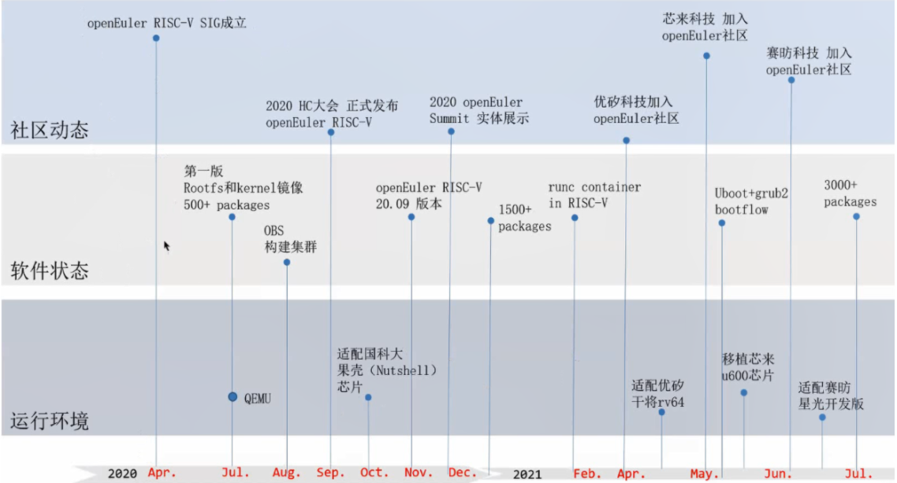

# 了解项目
## 项目简介
openEuler RISCV 是开源操作系统openEuler下的一个子工程，目的是让openEuler操作系统能够在RISC-V精简指令集硬件架构上运行。
openEuler riscv64与x86_64、aarch64是openEuler总工程下的不同的子工程（Project）；

本文档中描述的项目主体默认情况下全部都是openEuler riscv64；

## 项目现状
### 发展历史
这是openEuler RISCV SIG成立以来的一个发展图：

### 版本发布计划

下图是openEuler riscv的一个版本发布历史和规划：

- 半年发布一个创新版本：维护周期半年
- 2年发布一个商用版本（LTS）：维护周期4年；下游的OSV厂商基于LTS版本去做发行版提供给客户；

### 项目现状与主要任务
#### 项目现状：

- 当前openeuler（指x86和arm版本）已经发布的最新的创新版本为openEuler 21.09；
- 下一个发布版本是2022年3月发布的openEuler 22.03版本。

**openEuler riscv 22.03版本要支持的内容（我们要实现的阶段性目标）：**

1. 【已完成】Kernel 同步到5.10
1. 【重点，进行中】 Packages 支持
   - 数量上：支持3000+
   - 功能上：支持xfce桌面
1. 【重点，与2同步】将openEuler riscv的版本更新到最新的openEuler版本（这里的openEuler版本指的是x86、aarch64的最新版本。因为openEuler在riscv64、x86、aarch64等不同架构上，按照上游总工程的设计理念是**代码归一、同架构二进制归一**）
1. 【重要】支持UI：当前项目定义支持xfce
1. 【重要】支持更多的硬件：D1为当前默认测试开发板（因为有开发板可用）
1. docker image等其它

