### 查看自己的工程

1. 浏览器：https://build.openeuler.org/  并登录
2. 点击右上角的账号名
3. 根据project名点击进去查看project，也可以查看其下的packages。

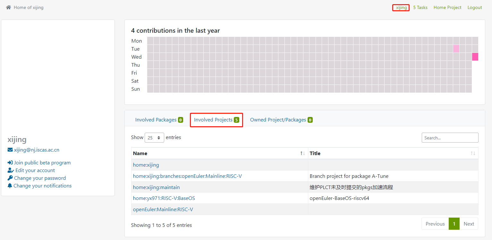

### 查看别人的工程

1. 浏览器地址栏中通过url中输入用户账号：https://build.openeuler.org/user/show/<obs-userid>

2. 能够出现类似上图的界面，然后就可以继续查看了

3. 根据project名点击进去查看project下的packages：这里就不详述了。

   

怎么知道别人的账号？

1. 在 Tasks列表中查看所有的submit信息，可以看到提交人的账号；
2. 找到一个project，在【Repositories】中，点【Add from a Package】；在弹出框中的project栏中输入home，会出现下拉列表，列表中home：后面的大多时注册用户的userid；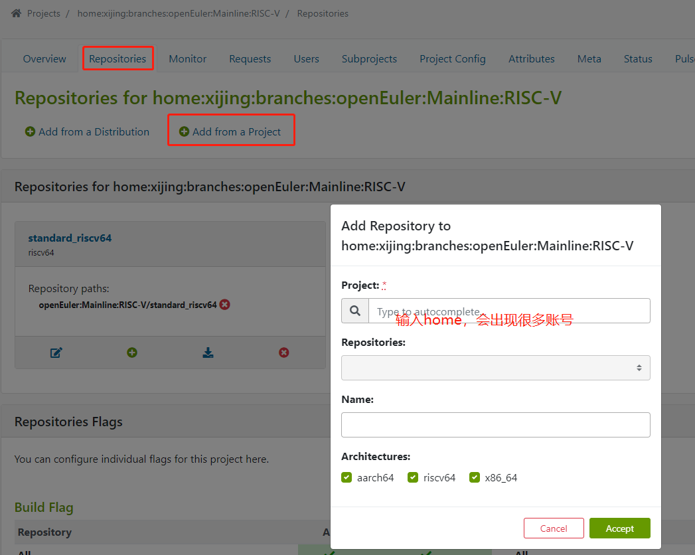

### 从mainline获取一个package到个人工程下

1. 浏览器访问https://build.openeuler.org/project/show/openEuler:Mainline:RISC-V  ，（可根据右侧构建状态点击进去按照包构建状态筛选）

   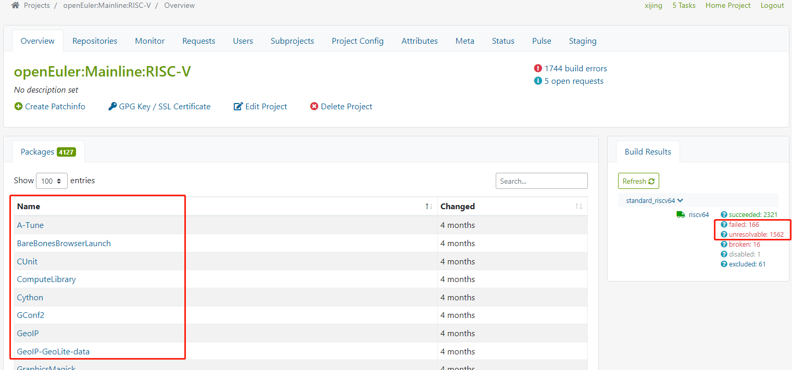

2. 点击包名进入后，点击【Branch Package】将包导入到自己的obs工程下

   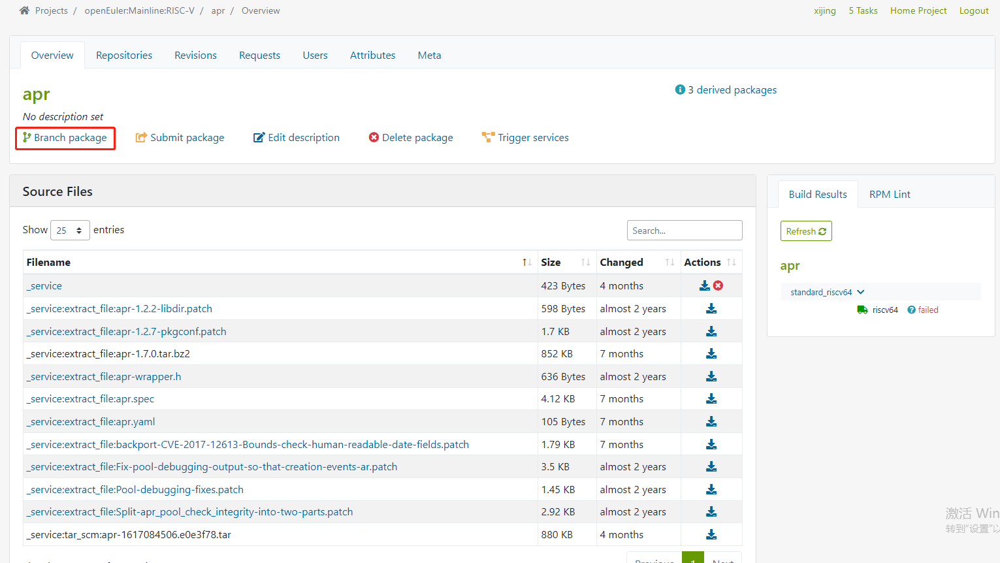

   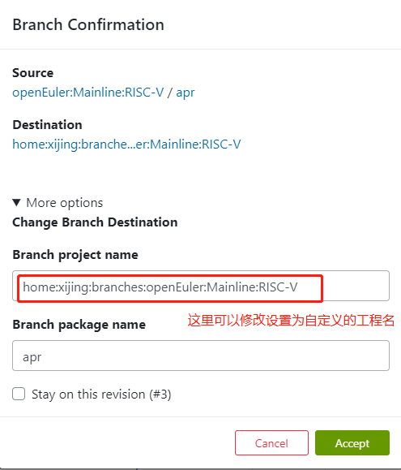

3. 点击【Accept】

### 提交一个submit

1. 检查build状态为succeeded
2. 点击【Submit package】
3. 填写submit信息：
   - To target project: *：openEuler:Mainline:RISC-V
   - To target package:   openEuler:Mainline:RISC-V中的包名（如果没有修改过一般不用写）
   - Description: *：对包做了哪些修改，需要认真填写，方便maintainer审核，也方便后续查询和追溯变更过程；
   - **多次提交同一个包，建议要么撤回之前的修改，要么在后续提交的时，替代之前的submit；**

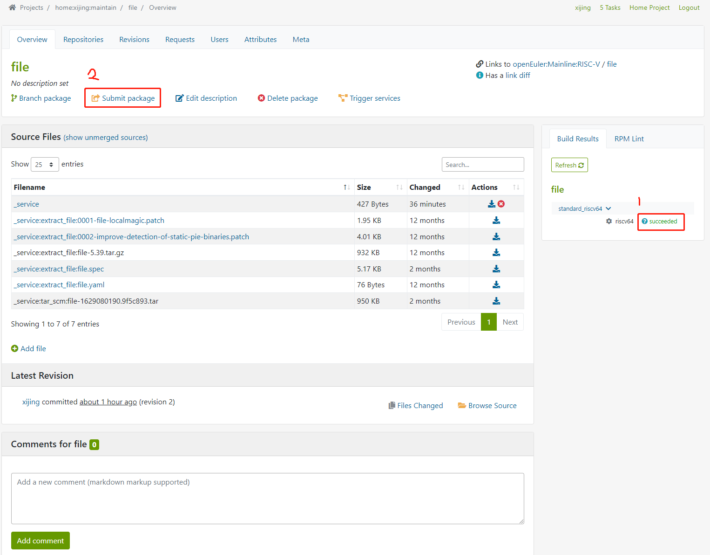

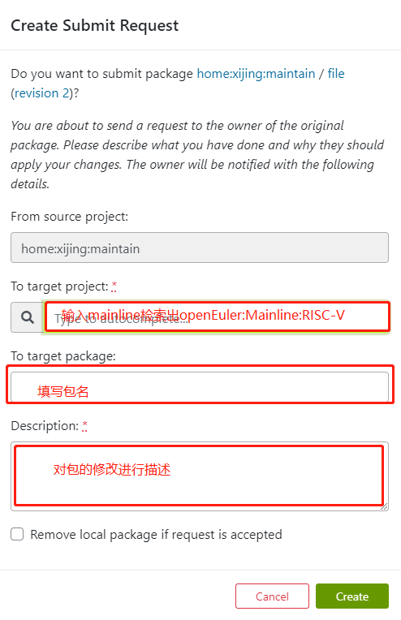

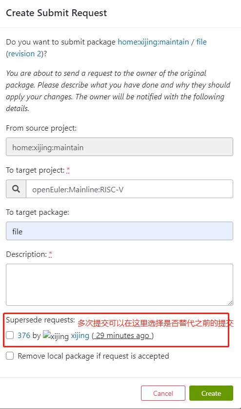

### 查看自己提交的submit 

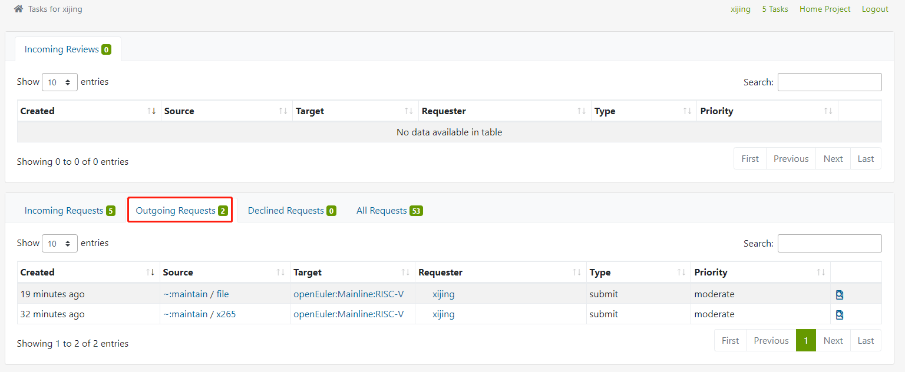

### 撤回obs submit

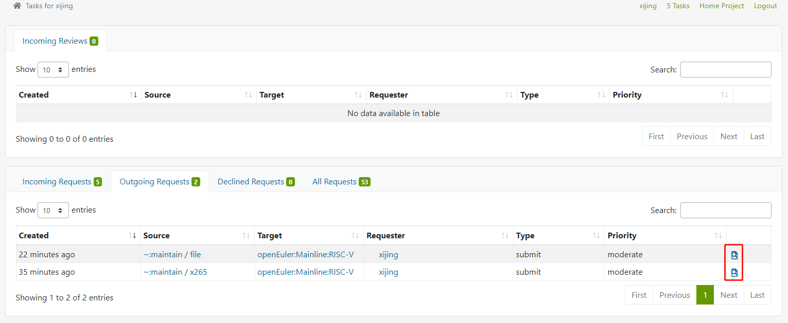

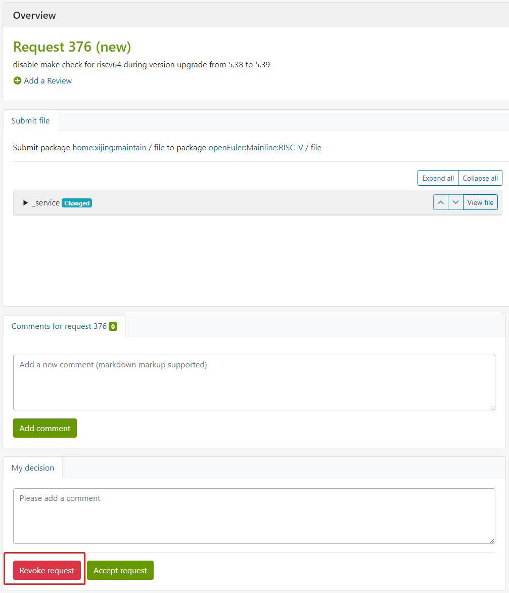

### 审核并合并submit

**有权限的人才可操作**

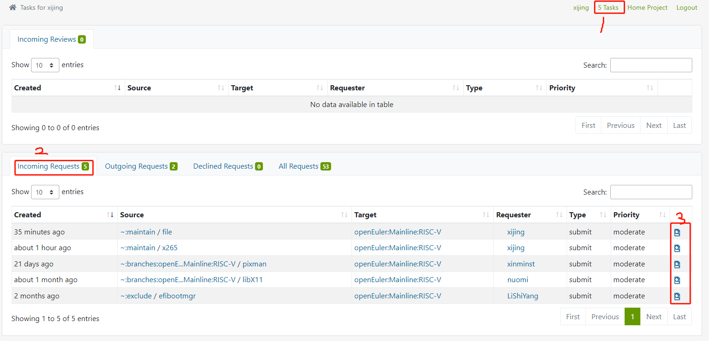

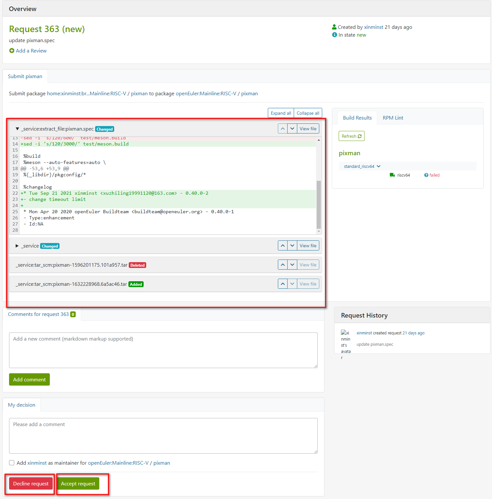

查看具体的修改内容，无问题后，点【Accept request】接受submit请求，完成合并；如需拒绝可以点【Decline request】；