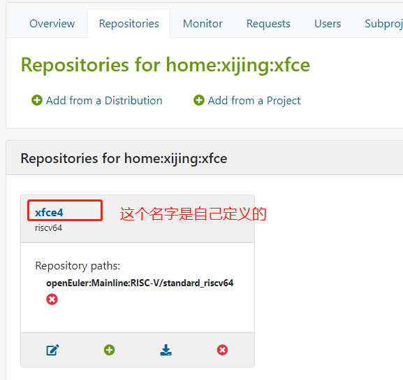
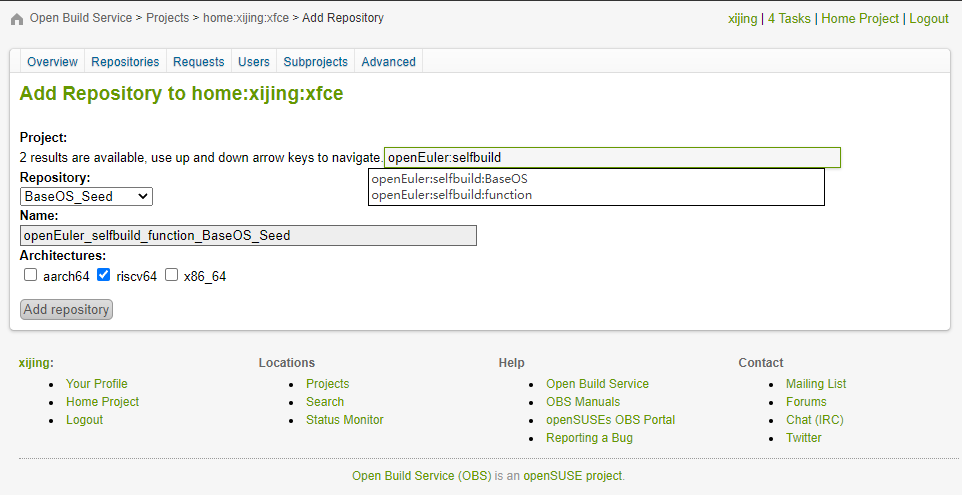
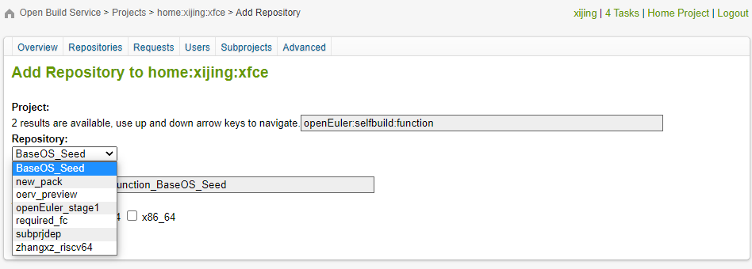
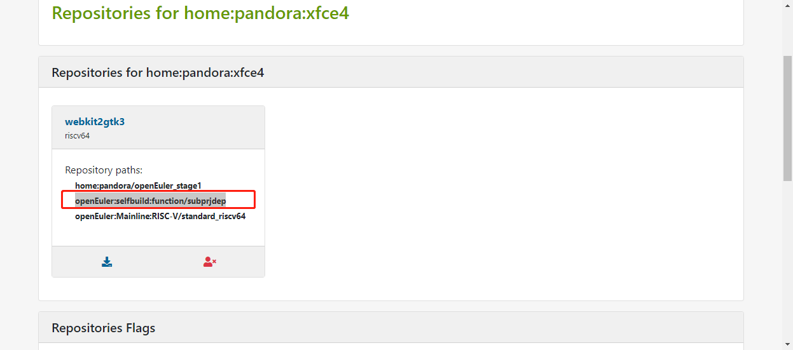
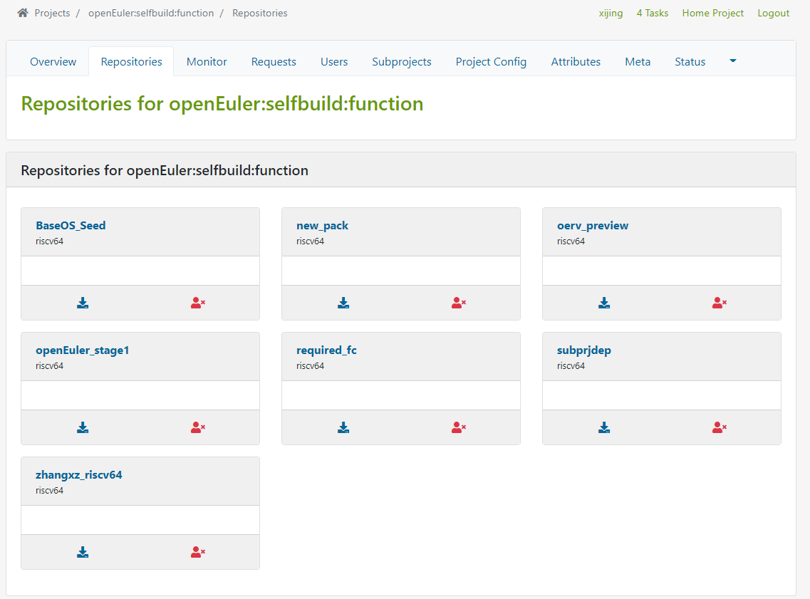
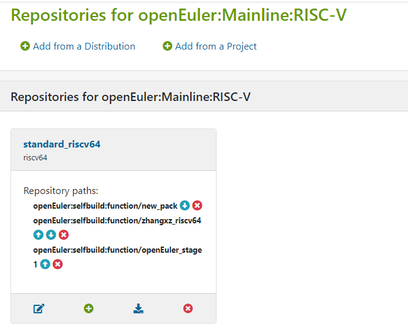
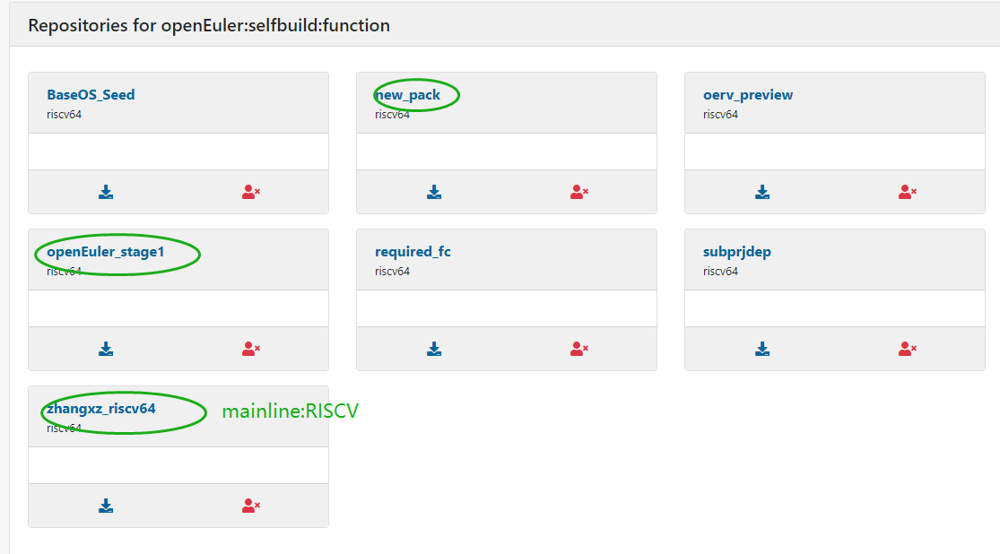
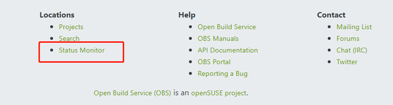
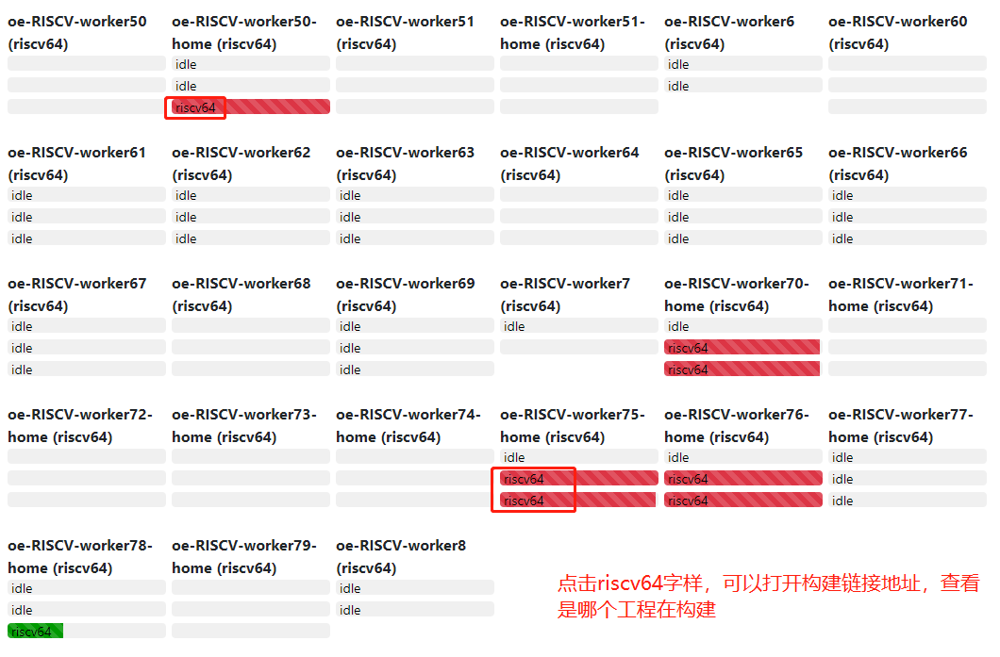

### 问题

#### [openEuler:selfbuild:function](https://build.openeuler.org/project/show/openEuler:selfbuild:function) 这个工程一个包都没有，是干什么用的？

[openEuler:selfbuild:function](https://build.openeuler.org/project/show/openEuler:selfbuild:function) 这个工程创建的目的主要不是用来管理包的构建的，而是通过Repositories的仓库定义和管理来汇总我们的仓库，目的是用于在协助的过程中与华为的依赖仓文件目录进行同步。（上图中的本质都是目录或者说仓库）

#### 各依赖仓都是干啥的？

https://build.openeuler.org/repositories/openEuler:selfbuild:function

### 查看obs构建服务器使用情况

