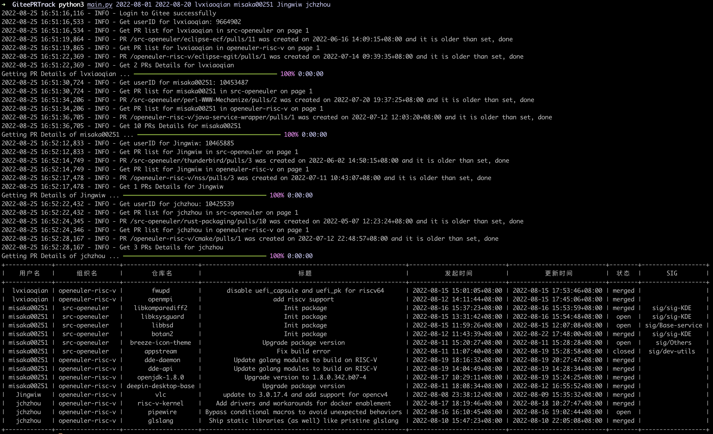
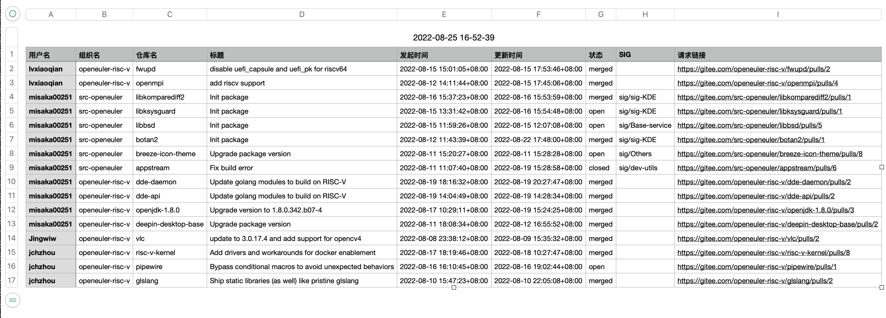

# Gitee PR Tracker

## 安装依赖及配置

`pip3 install -r requirements.txt `

运行前需要先在 `config.ini` 中配置 Gitee Cookie 和 Token，程序运行最开始会检测是否可以成功登录。

因为采用爬虫方式获取数据，Gitee 目前不允许未登录用户搜索 PR，所以需要可以成功登录的 Cookie。

可以在不设置 Token 的情况下使用，但 Gitee 的 API 限制较为严格，所以建议使用 Token。

Token 和 Cookie 字符串不需要使用引号包裹。

## 使用

`python main.py [开始时间] [结束时间] [用户名...]`

或者在 `usernames.txt` 的中配置用户名，每行一个用户，然后运行 `python main.py [开始时间] [结束时间]`。

如果 `usernames.txt` 中有用户名的配置则优先使用 `usernames.txt` 中的配置，否则使用命令行参数。

## 样例

`python3 main.py 2022-08-01 2022-08-20 lvxiaoqian misaka00251 Jingwiw jchzhou`

终端中会以 ASCII 表格的方式生成预览

文件夹下会生成以执行时间为名的 `csv` 文件，使用任何表格处理软件打开即可。

