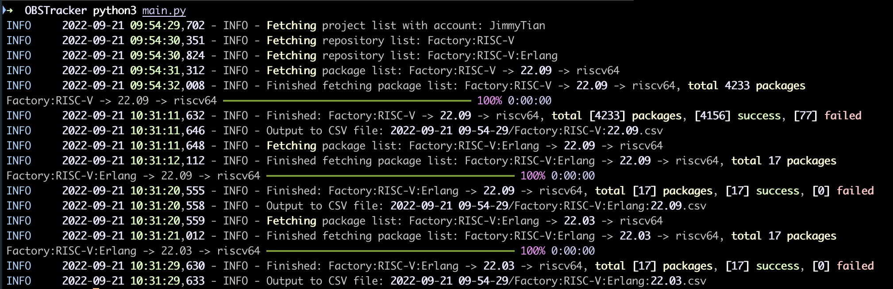
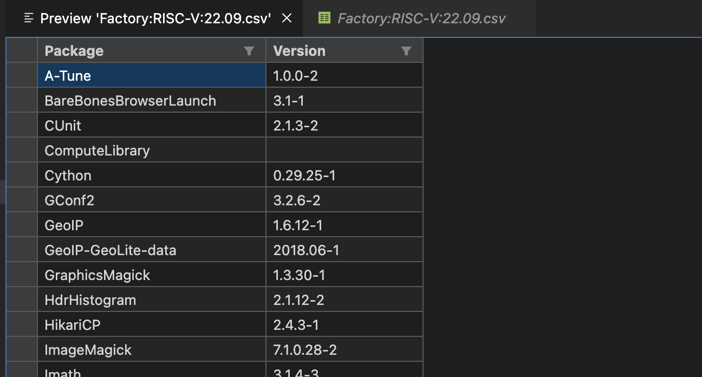

# OBS Version Tracker

## 安装依赖及配置

`pip3 install -r requirements.txt `

运行前需要先在 `config.ini` 中配置 OBS 的地址、用户名、密码。程序运行最开始会检测是否可以成功登录。

## 使用

在 `project.ini` 中配置需要抓取的工程，为每个工程新建一个 Section，使用 `[]` 包裹，可以同时配置多个工程。

在这个 Section 中，需要配置 arch 和 repo 两个参数，分别表示工程的架构和需要抓取的仓库。

arch 字段必须配置，repo 字段可以不配置，不配置时默认抓取所有仓库。

当需要抓取指定多个仓库时，repo 字段可以加入多个参数，使用逗号分隔。

运行 `python main.py` 开始抓取数据，在数据采集完成后，会在当前目录下创建以程序运行时间命名的文件夹，抓取的数据会保存在这个文件夹中。

每个仓库的数据会保存在一个单独的文件中，文件名为 `工程名:仓库名.csv`。

## 样例

```ini
[Factory:RISC-V]
arch = riscv64
repo = 22.09, Roll
```
这段配置会抓取 Factory:RISC-V 工程中的 22.09 和 Roll 仓库的数据。

```ini
[Factory:RISC-V:Rust]
arch = riscv64
repo =
```
这段配置会抓取 Factory:RISC-V:Rust 工程中的所有仓库的数据。

## 运行结果



终端中会显示抓取的进度，抓取完成后会显示抓取的数据量，包含仓库中的包数量、成功的包数量、失败的包数量。

其中，失败的包为无法抓取到构建时版本号的包。



csv 样例如上。

