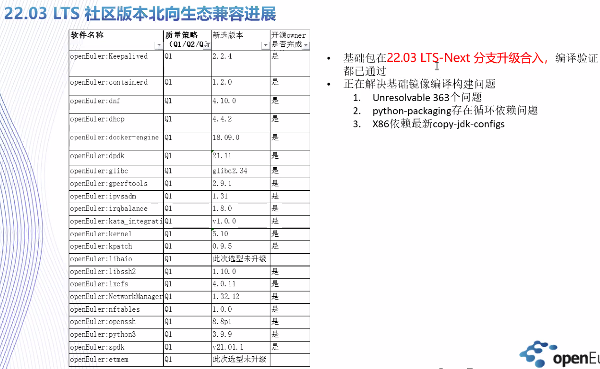

# 工作总结 [1.1-1.13]

| datetime | succeeded | failed | unresolvable | broken | disabled | excluded |
| -------- | --------- | ------ | ------------ | ------ | -------- | -------- |
| 20210922 | 1924      | 211    | 1913         | 16     | 1        | 62       |
| 20210930 | 2309      | 170    | 1570         | 16     | 1        | 61       |
| 20211030 | 2323      | 164    | 1562         | 16     | 1        | 61       |
| 20211130 | 2441      | 146    | 1475         | 2      | 1        | 61       |
| 20211215 | 2512      | 162    | 1390         | 2      | 1        | 60       |
| 20211229 | 2522      | 154    | 1389         | 1      | 1        | 60       |
| 20220112 | 2552      | 149    | 1364         | 1      | 1        | 60       |

1. 修包

   - 新提交的pr：

     - src-openeuler
       - [cfitsio](https://gitee.com/src-openeuler/cfitsio/pulls/4)  openEuler-22.03-LTS-Next
       - [jimtcl](https://gitee.com/src-openeuler/jimtcl/pulls/3) openEuler-22.03-LTS-Next
       - [apr](https://gitee.com/src-openeuler/apr/pulls/20)  master
       - [rdma-core](https://gitee.com/src-openeuler/rdma-core/pulls/27) openEuler-22.03-LTS-Next
       - [mstflint](https://gitee.com/src-openeuler/mstflint/pulls/17) openEuler-22.03-LTS-Next
       - [subunit](https://gitee.com/src-openeuler/subunit/pulls/27) openEuler-22.03-LTS-Next
       - [qt](https://gitee.com/src-openeuler/qt/pulls/32) openEuler-22.03-LTS-Next
       - [gd](https://gitee.com/src-openeuler/gd/pulls/24) master
       - [webkit2gtk3](https://gitee.com/src-openeuler/webkit2gtk3/pulls/40) master
       - [compiler-rt](https://gitee.com/src-openeuler/compiler-rt/pulls/24)  master
       - [openssl](https://gitee.com/src-openeuler/openssl/pulls/72) openEuler-22.03-LTS-Next
       - [ocaml](https://gitee.com/src-openeuler/ocaml/pulls/10) openEuler-22.03-LTS-Next
       - [haproxy](https://gitee.com/src-openeuler/haproxy/pulls/44) master
       - [augeas](https://gitee.com/src-openeuler/augeas/pulls/38) master
       - [libffado](https://gitee.com/src-openeuler/libffado/pulls/5) master
       - [grub2](https://gitee.com/src-openeuler/grub2/pulls/120) master
       - 
       - [libEMF](https://gitee.com/src-openeuler/libEMF/pulls/11) openEuler-22.03-LTS-Next
       - [etmem](https://gitee.com/src-openeuler/etmem/pulls/34)  openEuler-22.03-LTS-Next
       - [lxcfs-tools ](https://gitee.com/src-openeuler/lxcfs-tools/pulls/32) openEuler-22.03-LTS-Next
       - [perl-Sys-CPU](https://gitee.com/src-openeuler/perl-Sys-CPU/pulls/3) openEuler-22.03-LTS-Next
       - [python-markdown](https://gitee.com/src-openeuler/python-markdown/pulls/15) openEuler-22.03-LTS-Next
       - [python-tqdm](https://gitee.com/src-openeuler/python-tqdm/pulls/15) openEuler-22.03-LTS-Next

     - openEuler-risc-v   (最新，且未在src-openeuler中提交的pr)
       - [php](https://gitee.com/openeuler-risc-v/php/pulls/1) openEuler-22.03-LTS-Next 已合并 @lxq 回合到上游src
       
       - [sscg](https://gitee.com/openeuler-risc-v/sscg/pulls/2)  @xj
       
       - [systemd](https://gitee.com/openeuler-risc-v/systemd/pulls)  @lxq
       
       - [libkcapi](https://gitee.com/openeuler-risc-v/libkcapi/pulls) @mc
       
       - [gsl](https://gitee.com/openeuler-risc-v/gsl/pulls)   @mc
       
       - [ runc](https://gitee.com/openeuler-risc-v/runc/pulls)  @lxq
       
       - [kexec-tools](https://gitee.com/openeuler-risc-v/kexec-tools/pulls)  @lxq
       
       - [openblas ](https://gitee.com/openeuler-risc-v/openblas/pulls) @lxq
       
         
     
   - 正在进行的

     - oddjob 
       net-snmp 
       tzdata 
       socket_wrapper 
       zeromq 
       mariadb 
       crash 
       gettext 
       python-mako
       perftest
       custodia
       mozjs52
       oemaker
        libepoxy
       edk2

   - 问题1：由于中间仓openeuler-risc-v的包没有及时的向上游src-openeuler合并，从而当我们想从openeuler-risc-v向src-openeuler提交pr的时候，发现无法合并，原因是上游代码已经更新。我们不得不重新更新代码后再提交PR；

     ——》调整：对于正式员工+有信心的修复，直接向上游提交PR，以减少中间过程；而对于刚入职的新手（新人和实习生）则禁止直接向上游提交PR，必须先提交到中间仓经过riscv sig内部的合并审查后再向上游提交（建议中间仓合并后及时向上游提交PR）

     ——》问题：目前上游仓库的PR合并效率还是不那么及时的，而obs公共工程又禁止使用个人gitee仓库，这样obs工程中构建状态更新是滞后的，不能及时反映最新的构建状态。

     > - **obs工程中，直接使用MR分支的链接保证obs构建状态的及时更新，待上游合并后再行将obs工程中的_service恢复到master/branch分支上**
     > - 按需解决failed包，主要围绕目标去解决相关的包，不追求工程中的所有包都构建成功。独立的叶子节点的包优先级低。

   - 问题2：pr提交重复工作

     - 代码与上游冲突（主要是中间仓代码未更新）：见问题1

     - pr规范性的问题

       - spec中关于release版本新增、日志、patch来源等的说明
    - 在向src-openeuler 主仓提交pr的时候，需要加上构建成功的结果截图，原因描述等等，如果缺少这些，仓库的maintainer无法过去足够的信息来判定是否可以合入
       - Patch 应该默然包含，这样能保证 srpm 是统一的。如有必要，可以在构建过程中，根据架构选择打补丁。参考案例：https://gitee.com/src-openeuler/perl-Sys-CPU/pulls/3  和https://gitee.com/src-openeuler/rdma-core/pulls/27 

       > 请大家补充代码与pr规范性的一些约束要求。也注意关注自己提交的pr中的评论信息。
    >
       > 新人可参考贡献攻略：https://www.openeuler.org/zh/community/contribution/detail.html#_2-%E8%B4%A1%E7%8C%AE%E7%BC%96%E7%A0%81
    >
       > 代码风格、PR合入规范 还是要在实践中多学习，主要看已经被合并的pr和评论进行学习。

     - PR提交到哪里？

       https://gitee.com/openeuler/release-management/blob/master/openEuler-22.03-LTS/release-plan.md

       >由于openEuler 21.09版本是在8月11号从Master拉分支（https://gitee.com/openeuler/community/pulls/2567）
    >因此2021/8/11这个时间点之后的Master PR，可能需要回合到22.03-LTS-Next分支。
       >请各sig maintainer、开发者们知悉此情况，做好相关代码的回合（可利用/sync命令做分支代码同步），确保22.03-LTS-Next分支上的代码版本符合预期（最新？）。

       结论：openEuler-22.03-LTS-Next与master都需要提交

   ​    

   - 问题3：commiter修包状态的及时同步

     - 目前大家修包状态比较分散，建议在修包前创建一个issue（gitee上创建）

       后续任何人修包之前，都可以在gitee issue中通过包名进行搜索，没有则修包，有则观察issue状态是否转移任务

2. 围绕语言包进行依赖仓的补充和修包

   - Java

     - java：https://build.openeuler.org/project/show/home:pandora:mvn    构建中，等待结果
     - jdk：https://build.openeuler.org/project/show/home:pandora:openjdk
       - **java1.8**

   - python：升级

     - https://build.openeuler.org/project/show/home:lvxiaoqian:python3.8

       pytest与python-pluggy循环依赖

     - https://build.openeuler.org/project/show/home:lvxiaoqian:python3.9

   - perl：升级

     - perl：https://build.openeuler.org/project/show/home:pandora:perl
       - [perl](https://build.openeuler.org/package/show/home:pandora:perl/perl)包

   - golang：引擎成功，部分依赖未成功

     - 1.15.7成功：https://build.openeuler.org/project/show/home:pandora:golang  
     - 1.17成功 @xuzhou

   - nodejs：编译成功，打包失败

     - 12.18.4 nodejs：https://build.openeuler.org/project/show/home:pandora:nodejs
       - nodejs

   - php

     - 8.0.0成功 @晓倩 https://gitee.com/openeuler-risc-v/php/pulls/1    中间仓合并，需向上游回合

   - rust

     - 失败：https://build.openeuler.org/project/show/home:pandora:rust
       - rust

   - ruby

     - ruby：https://build.openeuler.org/project/show/home:pandora:ruby    building

   - **ocaml**

     - https://build.openeuler.org/project/show/home:pandora:ocaml

   - erlang

     - https://build.openeuler.org/project/show/home:pandora:erlang

## 社区动态

> 目前riscv工程中，第一优先级还是基础包构建成功，其次再是根据时间要素尽量追上游版本。倘若riscv工程与上游版本不一致，则需要单独列出进行说明。按需维护：riscv与x86/arrch的基础软件包版本差异列表

## 门禁

之前曹志老师提供的门禁仓库中的文档中描述的都是通用的门禁，目前已有，问新增riscv门禁具体是指什么？怎么做？

https://gitee.com/openeuler/openeuler-jenkins/blob/master/src/README.md

https://gitee.com/openeuler/openeuler-jenkins/blob/master/src/ac/README.md

问题1: riscv门禁具体要做什么？

> https://gitee.com/src-openeuler/libreswan/pulls/35
>
> riscv门禁特指的是构建rpm包的门禁，即参考上述链接中的与multiarch/src-openeuler/x86-64/libreswan和multiarch/src-openeuler/aarch64/libreswan 对应的riscv64的门禁

问题2：怎么添加？

> todo
>
> 了解下multiarch相关的repo或者文档   @xijing

