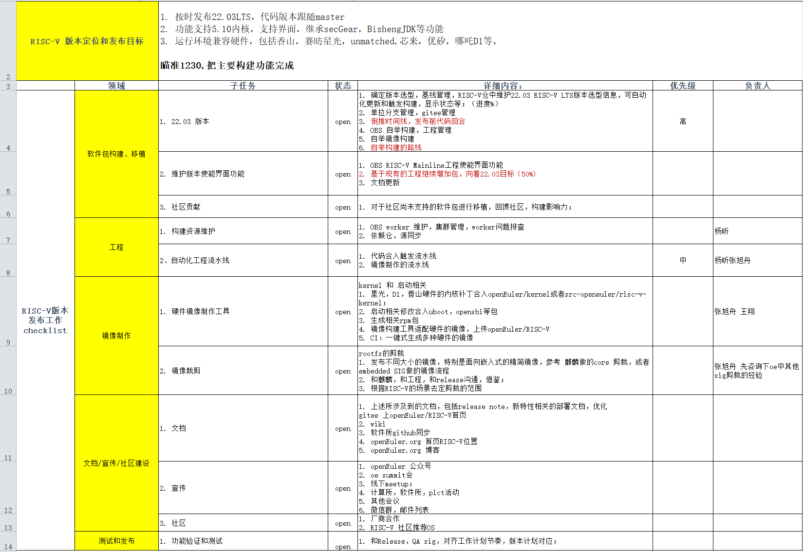

# 工作总结 [10.21-11.4]

## 过去两周的进展

1、[WIP] openEuler:Mainline:RISC-V工程构建：

| datetime | succeeded | failed | unresolvable | broken | disabled | excluded |
| -------- | --------- | ------ | ------------ | ------ | -------- | -------- |
| 20210908 | 1907      | 252    | 1889         | 16     | 1        | 62       |
| 20210922 | 1924      | 211    | 1913         | 16     | 1        | 62       |
| 20210926 | 2206  | 266    | 1576         | 16     | 1        | 62       |
| 20210930 | 2309      | 170    | 1570         | 16     | 1        | 61       |
| 20211009 | 2312      | 168    | 1569         | 16     | 1        | 61       |
| 20211020 | 2321  | 166    | 1562         | 16     | 1        | 61       |
| 20211030 | 2323  | 164    | 1562         | 16     | 1        | 61       |
- 合并的PR：
  - [解决util-linux构建失败](https://gitee.com/openeuler-risc-v/util-linux/pulls/1)
- 进行中的包：
  - python3.9：[issue#134](https://github.com/plctlab/openEuler-riscv/issues/134)
  - bazel：[issue#166](https://github.com/plctlab/openEuler-riscv/issues/166)  [obslink](https://build.openeuler.org/package/show/home:mc:branches:openEuler:Mainline:RISC-V/bazel)
  - openmpi：[issue#150](https://github.com/plctlab/openEuler-riscv/issues/150)  [obslink](https://build.openeuler.org/package/show/home:mc:branches:openEuler:Mainline:RISC-V/openmpi)
  - [【构建失败】原因分析包括：yum-metadata-parser、rubygem-redcarpet、rubygem-bindex、squid、rubygem-unf_ext、scap-security-guide、rubygem-sqlite3](https://github.com/plctlab/openEuler-riscv/issues/168)
  - [[构建失败\] 原因分析包括：subversion、kata-containers、golang、libvpx、php-cli、libtcnative、openjdk-1.8.0、openwsman](https://github.com/plctlab/openEuler-riscv/issues/183)

2、系统可视化桌面功能支持Xfce：

- D1上可用，继续完善和提升用户体验
  - https://build.openeuler.org/project/show/home:pandora:xfce
  - https://build.openeuler.org/project/show/home:pandora:xfce4
  - xfce测试：https://github.com/plctlab/openEuler-riscv/issues/181
- Lxde：梳理了所需的包、安装后渲染存在问题，优先级调低；
  - https://build.openeuler.org/project/show/home:pandora:lxde
  - lxde测试：https://github.com/plctlab/openEuler-riscv/issues/167

3、BaseOS for openEuler

- stage1:23个包全部构建成功
  - https://build.openeuler.org/project/monitor/home:zxs-un:openEuler:riscv64:BaseOS:stage1
- Stage2: 82个包 68个成功
  - https://build.openeuler.org/project/monitor/home:zxs-un:openEuler:riscv64:BaseOS:stage2
- 关注的包：
  - automake 可复现成功但不稳定
  - util-linux 可复现成功但不稳定
  - coreutils 发现它的变更对其余包的测试用例影响较大

4、其它

- 22.03发版计划讨论，对目标和任务进一步明确和完善

  - 主要的目标：

    - 1. 按时发布22.03LTS，代码版本跟随master
    - 2. 功能支持5.10内核，支持界面，继承secGear，BishengJDK等功能
    - 3. 运行环境兼容硬件，包括香山，赛昉星光，unmatched,芯来，优矽，哪吒D1等

  - 时间：

    - 瞄准12月30日,把主要构建功能完成；
    - **与release组进行时间线对接**，提前规划代码回合的时间

  - 要点：

    - 将自举构建系统**BaseOS的优先级提高**，计划在22.03发布；

    - 继续维护当前的mainline:RISCV，**使能界面功能**；

    - 镜像制作（制作工具、镜像裁剪）相关工作；

    - 详见：

      

- BaseOS路线和问题讨论

  - 基于22.03发版目标，整理出一个用于打包到镜像中的软件包清单
  - 对软件包进行分组管理（按照功能分组，分别放在不同的project或者stage中）
  - 提升当前stage2中从未构建成功的包解决优先级

  

## 未来两周计划

1. 22.03

   - 基于22.03发版目标，整理出一个用于打包到镜像中的软件包清单
   - 确定版本选型，基线管理，RISC-V仓中维护22.03 RISC-V LTS版本选型信息
   - 单拉分支管理，gitee管理
   - 时间线：与release sig沟通，倒推时间线
   - 自举构建路线
2. 维护版本使能界面功能

   - 使能界面
     - 继续xfce包测试，增强功能及对应软件包的梳理和增加
   - fix failed and unresolvable
     - 优先围绕xfce软件包，优先处理其依赖链上的问题包

3. 工程、镜像制作 ：可开始准备
4. 文档、宣传：按需随时开展

### 问题

1. 近期obs平台存在一些问题，期望尽快恢复
2. 增加有经验的人员投入

