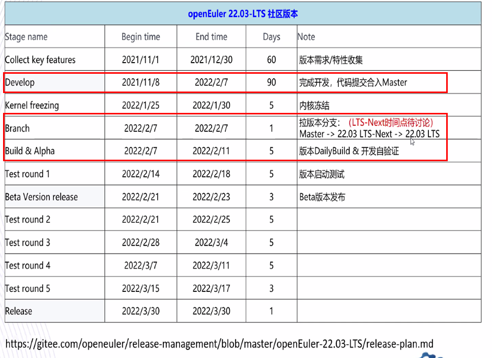

# 工作总结 [11.4-11.17]

## 过去两周的进展

1、openEuler RISC-V 22.03 LTS 版本的讨论

**RE: 【会议通知】 openEuler RISC-V架构适配计划/策略讨论，时间：2021-11-15 16:30-17:30(UTC+08:00)，地点：线上会议**

>**议题交流纪要：**
>
>**商用场景和版本定位：**
>\1. 当前商用的场景主要是软件所和RISC-V基金会设立的RISC-V lab，会面向全球提供支持RISC-V的主流OS镜像以及可访问的RISC-V云环境。
>\2. 涉及到商用场景的支持，可在最小集中提供LTS支持，通过openEuler的LTS源发布，典型应用场景（容器引擎和编排工具，语言包，界面）做基本功能验证，不能保障质量的软件包 在oepkg的repo 源中提供。后续持续进行软件包的新增和质量看护。
>
>
>**基础设施**
>\1. 当前RISC-V基础设施有OBS和部分CI，需要补齐门禁功能，镜像流水线以及其他功能
>\2. 所需硬件资源可使用软件所的RISC-V 硬件，需要infra sig 沟通部署方式
>
>
>**云原生&容器**
>\1. 在openEuler RISC-V 可按照其他架构提供isula作为可选的容器引擎，与isula sig 协作讨论版本问题
>\2. 制作openEuler RISC-V 容器镜像，并归档到镜像仓库，可在包括RISC-V的不同架构平台上识别架构并自动拉取相应架构的容器镜像
>
>
>**测试验证**
>\1. 测试策略如上，根据最小集软件包范围梳理进行LTS质量保障的软件包。先拉齐软件包范围。
>\2. 软件所目前有4个人力 专职/兼职 进行测试验证工作，可协调进行基本功能验证等。
>
>
>**社区sig间技术联创协同**
>\1. 后续加强openEuler和软件所协作，例如22.03 新增的重点特性，可以由软件所同步在RISC-V上进行特性移植支撑工作，共同造势宣传openEuler 多样化算力支持。
>
> 
>
>与会讨论人员:
>
>Wu wei、Xi jing、Wang jianming、胡欣蔚、熊伟、张旭舟、李永强、李次华、伍伯东、谢志鹏、黎亮、陈亚强
>
>

在系统功能和软件包范围、质量保障方面（席静的记录和理解）：

>- 从真实使用场景需求出发，收集到PLCT riscv CI lab对docker容器的需求；
>
>- 从LTS版本主打长期维护+稳定性的考虑，22.03 oe-rv的功能以系统基础为主，在功能上初步讨论支持：
>  （1）内核
>   （2）容器：docker；（在openEuler RISC-V 可提供isula作为可选容器芯片，可与isula sig协作讨论版本问题）
>   （3）语言包
>   说明：暂时不加桌面功能、k8s集群相关功能
>
>- 从操作系统软件包的数量和内容考虑，oe-rv64基础软件包列表，基本上参考以下原则：
>
>  参考其它架构22.03【基础软件包列表】，
>  对于【基础软件包列表】定义范围内的包，纳入到发版内容中；
>  对于【基础软件包列表】定义范围之外的包，认为优先级低，不纳入22.03发版范围，放到后续的版本或者oepkg中提供安装包下载；
>
>- 从QA 的角度，对oe-rv64在质量保障方面的需求进行了了解：
>  （1）构建测试：构建成功
>   （2）软件功能测试：安装+运行使用
>   （3）稳定性测试：针对LTS发行版，稳定性是核心，参考openeuler
>   （4）兼容性测试：需要
>   （5）性能测试：rv64咱无特殊要求
>   （6）安全测试：rv64咱无特殊要求
>
>

2、[WIP] openEuler:Mainline:RISC-V工程构建：

| datetime | succeeded | failed | unresolvable | broken | disabled | excluded |
| -------- | --------- | ------ | ------------ | ------ | -------- | -------- |
| 20210908 | 1907      | 252    | 1889         | 16     | 1        | 62       |
| 20210930 | 2309      | 170    | 1570         | 16     | 1        | 61       |
| 20211030 | 2323  | 164    | 1562         | 16     | 1        | 61       |
| 20211117 | 2323  | 163   | 1563        | 16     | 1        | 61       |
openEuler:Mainline:RISC-V 没有什么变化，主要是因为大家**都在个人obs上构建**，还未提交；

- 进行中的包主要有：
  - docker相关的包：[Show home:pandora:docker](https://build.openeuler.org/project/show/home:pandora:docker)
  - subversion
  - python3.9：[issue#134](https://github.com/plctlab/openEuler-riscv/issues/134)
  - bazel：[issue#166](https://github.com/plctlab/openEuler-riscv/issues/166)  [obslink](https://build.openeuler.org/package/show/home:mc:branches:openEuler:Mainline:RISC-V/bazel)
  - openmpi：[issue#150](https://github.com/plctlab/openEuler-riscv/issues/150)  [obslink](https://build.openeuler.org/package/show/home:mc:branches:openEuler:Mainline:RISC-V/openmpi)

3、BaseOS for openEuler

- stage1:23个包全部构建成功
  - https://build.openeuler.org/project/monitor/home:zxs-un:openEuler:riscv64:BaseOS:stage1
- Stage2: 82个包 68个成功
  - https://build.openeuler.org/project/monitor/home:zxs-un:openEuler:riscv64:BaseOS:stage2
- Stage3: 139个包 104个成功
  - https://build.openeuler.org/project/show/home:zxs-un:openEuler:riscv64:21.09:stage3

## 未来两周计划

1. 22.03
   
   - 进一步明确22.03发版内容，软件包范围
   
   - 进一步确定未定的软件包版本
   
   - 大致时间线
   
     
   
     | 发版需求                                        | 2021/11/1  | 2021/12/30 |
     | ----------------------------------------------- | ---------- | ---------- |
     | 开发                                            | 2021/11/1  | 2022/1/30  |
     | 以功能支持+fix问题包的主要开发阶段(测试驱动)    | 2021/11/1  | 2021/12/30 |
     | 以测试为主的完善阶段                            | 2021/12/30 | 2022/1/30  |
     | 代码回合（openeuler-risc-v向src-openeuler回合） | 2021/12/30 | 2022/1/30  |
     | Alpha自验证                                     | 2022/2/7   | 2022/2/11  |
   
   
   
2. 根据需求，继续修包：对照功能、软件包范围 有重点的解决构建未成功的包

3. [进行中]docker功能支持：添加docker相关的包并使之构建成功

## 问题

1. 22.03软件包范围

2. 语言包：具体支持哪些语言包？是否都支持？

   - java

   - python

   - perl

   - go

   - ruby

   - ……

3. 

