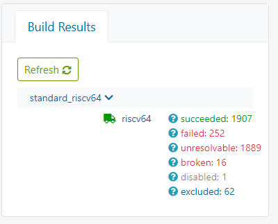
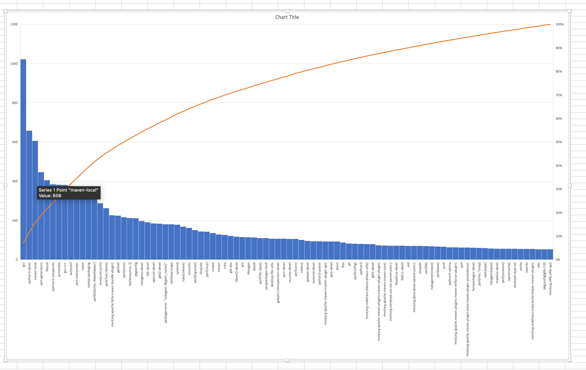

# PLCT工作总结 [8.26-9.9]

## 过去两周的进展

1. 团队建设：新增5名实习生

2. [WIP] 继续解决构建失败的包，完成21.09发版计划：计划成功支持3000+包+UI+bishengJDK+docker等特定软件包

   

   - 虽然成功构建了1900+个包，但是很多基础的包如glibc、coreutils、webkit2gtk3等都[未构建成功过一次](https://github.com/plctlab/openEuler-riscv/blob/main/weeklyreports/%E5%8C%85%E6%9E%84%E5%BB%BA%E7%8E%B0%E7%8A%B6.md)。

   - kernel、gcc等包构建时而成功，时而失败。很不稳定。——》感觉目前还没有形成一个可用的bootstrap。需要找到问题，让构建结果能够稳定下来。

   原因：

   - [riscv迭代构建问题](https://github.com/plctlab/openEuler-riscv/blob/main/weeklyreports/riscv%E8%BF%AD%E4%BB%A3%E6%9E%84%E5%BB%BA%E9%97%AE%E9%A2%98.md)
   - 还有哪些问题导致当前的现象？

   后续：

   - 为riscv建立一个源码仓
   - 计划先解决glibc、coreutils、webkit2gtk3等包。列一个list

   

3. [WIP]  BaseOS：刚开始，梳理出用于构建riscv linux操作系统的基础包。@孙喆炘

   - 第一批构建目标（76个基础包）：https://gitee.com/zxs-un/openEuler-port2riscv64/blob/master/doc/build-obs-baseos-repo.md
   - 构建地址：https://build.openeuler.org/project/show/home:yx971:RISC-V:BaseOS

   bootstrap的进展现在卡在了[make](https://build.openeuler.org/packages/make/job_history/openEuler:Mainline:RISC-V/standard_riscv64/riscv64)这个包上，但是华为的obs我没权限去操作它的种子文件夹。目前期待PLCT自己的obs环境。

   

   问题：有没有办法去解决？

   

4. [WIP] 9.23演示D1/BishengJDK 图形界面的游戏  @王翔

   - D1+openEuler：D1 openEuler 第四版镜像(docker)下载地址：https://mirror.iscas.ac.cn/plct/openEuler-D1-wifi-hdmi-docker-20210826.img.bz2

   - D1+openEuler：D1 openEuler 第五版镜像(xfce)下载地址：（暂时未公开到plct mirror，计划解决一些问题后再更新）

   - [bishengJDK](https://gitee.com/openeuler/RISC-V/issues/I28H7L?from=project-issue)：本地编译运行测试通过；**rpm打包后续在obs构建平台中补充；**
   
   ​    后续：
   
   - 以上镜像的内核是基于`Linux openEuler-RISCV-rare 5.4.61 `,接下来升级到5.10；
   - 继续集成docker、xfce等更多功能。

   

5. 桌面图像界面的支持(xfce)：已经基本完成，还有一些问题待解决。@王俊强

   - 菜单栏等重影黑块问题

   - 卡，慢

     

6. 工具开发 @吴洁
   - 对openEuler:Mainline:RISC-V现有的4000+个包的spec文件描述的依赖关系BuildRequires进行数据抓取和分析，[统计到被依赖最多的包如下图所示](https://github.com/plctlab/openEuler-riscv/issues/72)：
   
     
   
     
   
7. 测试工作 @吴洁 
   - D1 openEuler 第五版镜像(xfce)测试：[问题列表](https://github.com/plctlab/openEuler-riscv/issues?q=is%3Aissue+is%3Aopen+xfce)
   - [bishengJDK java demo下棋游戏在[D1 openEuler 第五版镜像(xfce)]上的运行测试](https://github.com/plctlab/openEuler-riscv/issues/90)

## 未来两周计划

1. 重点针对obs构建中的问题进行跟进。
   - 工作流程
   - 待解决包list
2. D1镜像的升级
   - 包含kernel升级到5.10
   - xfce一些重要问题的解决

## 问题

如上；

[实习生可见交付物清单](https://github.com/plctlab/openEuler-riscv/blob/main/weeklyreports/membersAchi9.8.md)

> 目前有尝试去解决，还是卡在一些问题上，需要先解决关键路径问题，让构建进入自循环，才方便更多的人加入进行贡献。

