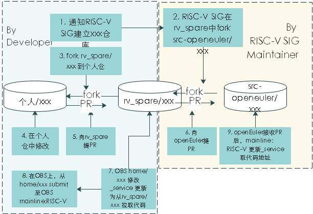

## 问题介绍

**议题：**RISC-V 版本的迭代构建问题以及单独分支进行快速迭代的可行性。

**背景：**随着 PLCT 的加入，过去一两个月 RISC-V SIG 做了若干工作，包括在 openEuler on RISC-V 中运行 docker、xfce、Bisheng JDK 等，也和包括 Compiler 、 CI 等 SIG 做了多次交互。也在过程中遇到围绕构建相关的问题，需要与大家商讨解决。

**情况说明：**

        一般的构建过程如下（以下 obs 代指：https://build.openeuler.org/project/show/openEuler:Mainline:RISC-V）
    
        Step 1：准备基础软件源，目前是之前生成的 openEuler RISC-V 软件源
        Step 2：obs：从 src-openeuler/… 中拉取 master 分支的源代码
        Step 3：obs：基于 Step 1 源编译生成二进制包
    
        如果软件包编译成功：
    
        Step 4：obs 将生成好的软件包更新到 Step 1 的软件源中
    
        如果软件包编译失败：
    
        Step 5：开发者分析失败原因，如果是自身软件包问题修改源码/Spec，如果是依赖问题，则找到对应的软件包，修改源码/Spec
        Step 6：开发者本地通过 osc 等方式验证软件包的编译是否能够通过，如果成功则进入 step 7，否则继续修改软件包
        Step 7：建立 PR，提交修改的代码/补丁至 src-openeuler/… 的 master 分支
        Step 8：等待对应软件包的 maintainer 审核 PR，没有问题后合并
        Step 9：obs：开发者在手动修改 _service 文件拉取 master 分支的最新版本编译构建，如果成功则解决，如果失败，则从 Step 5 继续

**问题1：**整个流程时间会超长，并且会由于一些意外原因的导致编译失败的问题发生而需要重新走流程。

        1. 由于流程涉及多个 SIG 组的协作，PR 合并的时间预期会比较长
        2. 很多 Step 都是开发者手动完成的，甚至有些操作还需要 CI 或基础设施的人员处理才行，比如 Step 4 到 Step 1 这一步。
        3. 如果有基础包的更新，会导致 obs 上出现大规模重新编译，RISC-V 的构建时间会比 x86 和 arm 的长很多，会导致开发者的工作需要等待重新编译完成后才能进行
        4. RISC-V 的基础软件源还不稳定
        5. master 分支的更新更多的是非 RISC-V 的更新，所以在修改支持 RISC-V 的过程中，其实会引入其他 master 的修改，进而容易导致之前的验证结果无效。

**解决问题的一个提议：**

是否可以单独建立一个 RISC-V 的分支或者 fork  src-openeuler 软件仓库？
把 RISC-V 的迭代可以在这个分支和 RISC-V 的软件源中进行，目的是整个流程由 RISC-V maintainer 和 committer 即可完成，没有问题后再由 maintainer 负责
定期提交到 master 分支以及 pull master 分支的最新修改。


**问题2：**构建效率低，增加一些构建资源。

```
目前RISC-V是使用 qemu RISC-V on x86 来做构建的；构建一次需要2-3天，希望有更多的构建资源能够提供。
```


**会议结论：**

- 1、同意采用 fork 部分软件包仓库的方式

- 2、在 openEuler/RISC-V 中采用 git submodule 管理 RISC-V 版本的软件包集合

- 3、@caozhi 代表 Infra 与 RISC-V SIG 对接

- 4、与 @fengguang 对接 基于 ARM 的虚机构建资源


---

针对上述结论，我们整理下具体的需求：

**1、建立一个riscv的软件包仓库，采用从src-openeuler主仓库 fork 部分软件包仓库的方式建立riscv自己需要独立维护的部分软件包源码仓**

流程：



图中的rv_spare就是上述的riscv 软件包仓库（计划只fork部分src-openeuler的软件包，维护riscv需要修改的源码仓）

> 经过讨论开分支的方法依然需要mantianer去做，不能达到及时响应的目的。因此采用建立一个group的方式来管理软件包仓库。


需求：

1. riscv源码仓需要是一个group，下面能够创建很多源码包仓库（一个软件包一个仓库）；
2. 把 RISC-V 的迭代可以在riscv的软件源（对应上图中的rv_spare），目的是整个流程由 RISC-V maintainer 和 committer 即可完成，没有问题后再由 maintainer 负责定期提交到 master 分支以及 pull master 分支的最新修改。


**2、在 openEuler/RISC-V 中采用 git submodule 管理 RISC-V 版本的软件包集合**

按照上述的方式进行流程调整之后，就会存在obs构建时使用的代码基线变成：一部分在src-openEuler，一部分在rv_spare。这就需要RISC-V对每个软件包的url、版本等信息进行管理。

因此提出了采用 git submodule 管理 RISC-V 版本的软件包集合的建议。


为了维护：RISC-V中使用的每个包的代码版本信息  <----->  构建系统所需的构建软件包配置文件 

我们计划通过**工具**进行管理，实现“包的代码版本信息”与“构建系统所需的构建软件包配置文件 ”之间的数据自动更新。

> 初步想法是：比如向rv_spare仓a合了一个代码修改，那么a的version就变了，这个时候RISC-V/下的a的submodule更新，然后工具根据更新的submodule信息生成obs里a的service文件，自动构建出新的包

> [risc-v/configuration/rv_fmt_cfg](https://gitee.com/openeuler/RISC-V/blob/master/configuration/rv_cfg.list)  


问：

- 能否给建一个官方的riscv的group（图中rv_spare所处的位置），用来维护我们的源码包？  @曹志
- 针对上述的1、2两个想法，之前是否有类似的需求或者工具可以使用？
- 怎么去建立自动化？


**4、基于 ARM 的虚机构建资源**

- 有多少资源可用

- 如何接入到现有obs中

  

