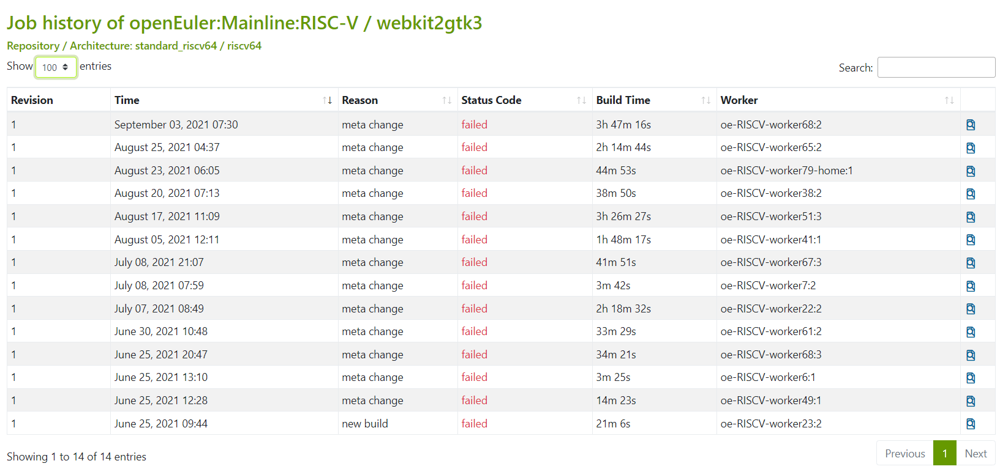

包构建状态整理时间：2021-9-8日晚上20:00-20:30左右

- [x] bzip2

- [x] bison

- [x] bash

- [x] binutils

- [ ] **coreutils** https://build.openeuler.org/packages/coreutils/job_history/openEuler:Mainline:RISC-V/standard_riscv64/riscv64

  

- [x] diffutils

- [x] findutils

- [ ] **gawk** https://build.openeuler.org/packages/gawk/job_history/openEuler:Mainline:RISC-V/standard_riscv64/riscv64

  

- [ ] **gcc**  https://build.openeuler.org/packages/gcc/job_history/openEuler:Mainline:RISC-V/standard_riscv64/riscv64

  

- [ ] **glibc**  https://build.openeuler.org/packages/glibc/job_history/openEuler:Mainline:RISC-V/standard_riscv64/riscv64

  

- [x] grep

- [x] gzip

- [x] m4

- [ ] **make**  https://build.openeuler.org/packages/make/job_history/openEuler:Mainline:RISC-V/standard_riscv64/riscv64

  

- [x] patch

- [ ] **risc-v-kernel**   https://build.openeuler.org/packages/risc-v-kernel/job_history/openEuler:Mainline:RISC-V/standard_riscv64/riscv64

  

- [x] sed

- [x] texinfo

- [x] tar

- [x] xz

- [ ] **webkit2gtk3**  https://build.openeuler.org/packages/webkit2gtk3/job_history/home:liujiawei:branches:openEuler:Mainline:RISC-V/standard_riscv64/riscv64

以上是实习生整理的bootstrap的第一批的[20个包](https://gitee.com/zxs-un/openEuler-port2riscv64/blob/master/doc/build-obs-baseos-repo.md)，当前obs构建的成败情况。

从上述来看，gcc、glibc、kernel等都会经常构建失败。成功次数寥寥，而且在不修改source的情况下，只更新依赖仓就会出现这些变化。

处理：

1. 分别把这些构建失败的包，在本地构建进行验证
   - 本地编译：本地编译包A的时候，可能需要依赖其他的rpm包，那这些被依赖的rpm包（rpmpkgs），我们根据实际情况，或选择源码编译成rpm，或选择fedora等其它可直接下载的rpm。
   - A包本地编译成功后，将其依赖的rpmpkgs更新到源（依赖仓）中，让A包能够在obs上构建成功。
   - A包构建成功后，将A包的rpm也更新到源（依赖仓）中，供其它依赖它的包调用。

> 如果有很多这样的包，我们就都按照这种方式去处理。

然后构建之前，还需要建立源码版本基线：
按照之前讨论的，主要定版本的是：

- kernel
- gcc
- glibc

上述20个包中，目前一次都没有构建成功的包有glibc、coreutils。后续将首先解决这两个包的问题。

---

此外，我们对openEuler:Mainline:RISC-V现有的4000+个包的spec文件描述的依赖关系BuildRequires进行数据抓取和分析，统计到被依赖最多的包如下图所示：

- [ ] gcc

- [ ] python3-devel

  > 问题：obs中搜索python有很多包，但是搜索python3只有两个包：[python3](https://build.openeuler.org/package/show/openEuler:Mainline:RISC-V/python3)   [python3-mallard-ducktype](https://build.openeuler.org/package/show/openEuler:Mainline:RISC-V/python3-mallard-ducktype)
  >
  > 那么，是否存在obs的包名与spec包名不一致的问题？
  >
  > 检查：工具抓取数据是否有问题。

- [ ] maven-local

  > 没有这个包

- [x] ### perl-generators

- [ ] libtool

  > 一次都未构建成功；https://build.openeuler.org/packages/libtool/job_history/openEuler:Mainline:RISC-V/standard_riscv64/riscv64

- [ ] python3-setuptools

  > [python-setuptools](https://build.openeuler.org/package/show/openEuler:Mainline:RISC-V/python-setuptools) 没有python3-setuptools，只有python-setuptools——》unresolvable：nothing provides python3-wheel

- [ ] automake

  >  一次都未构建成功；https://build.openeuler.org/packages/automake/job_history/openEuler:Mainline:RISC-V/standard_riscv64/riscv64

- [ ] gcc-c++

  > [gcc](https://build.openeuler.org/package/show/openEuler:Mainline:RISC-V/gcc)    
  >
  > [gcc_secure](https://build.openeuler.org/package/show/openEuler:Mainline:RISC-V/gcc_secure)
  >
  > [relaxngcc](https://build.openeuler.org/package/show/openEuler:Mainline:RISC-V/relaxngcc)

- [x] autoconf

- [ ] perl-

- [ ] make

  > 当前失败，但是曾经构建成功过；

- [ ] 

